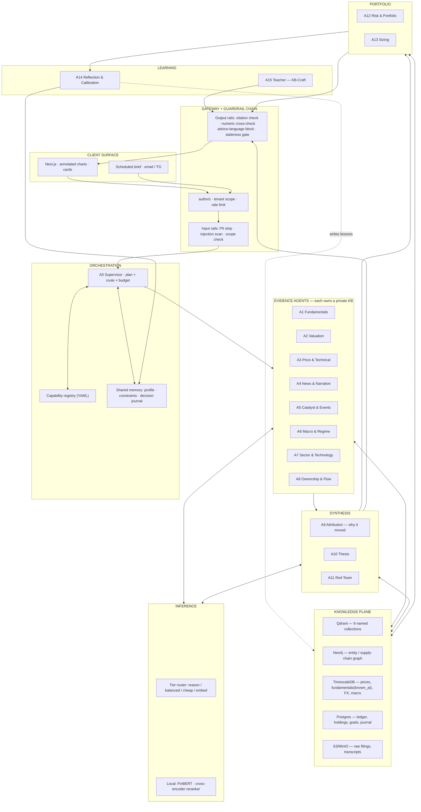
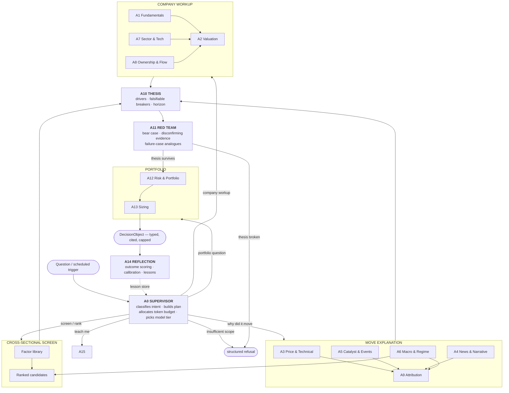
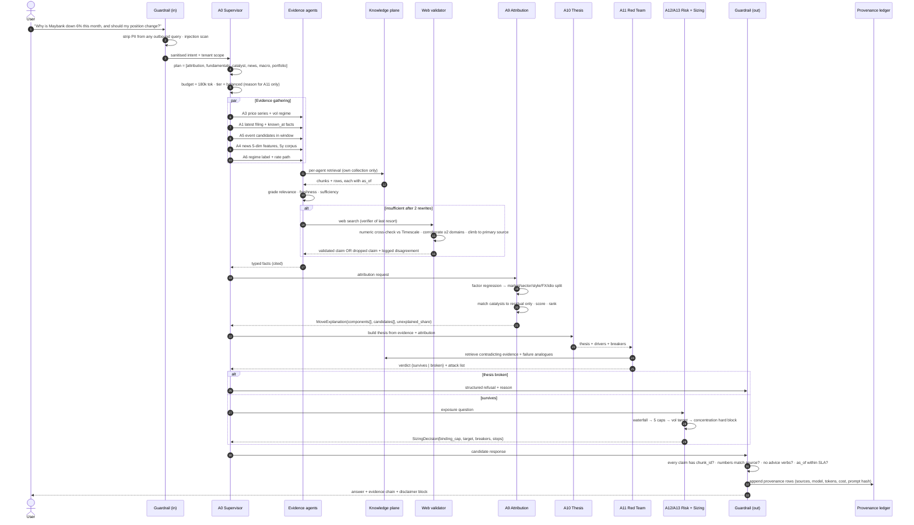
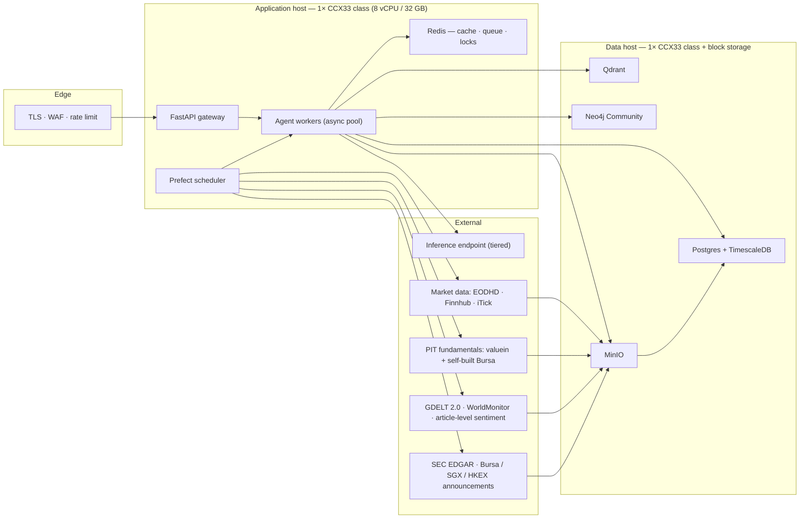
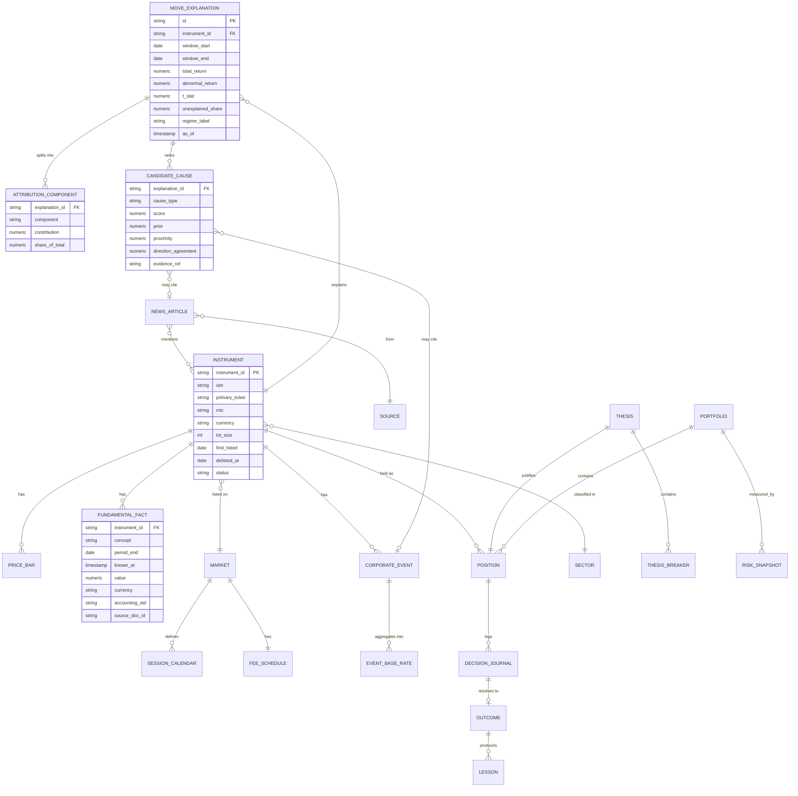
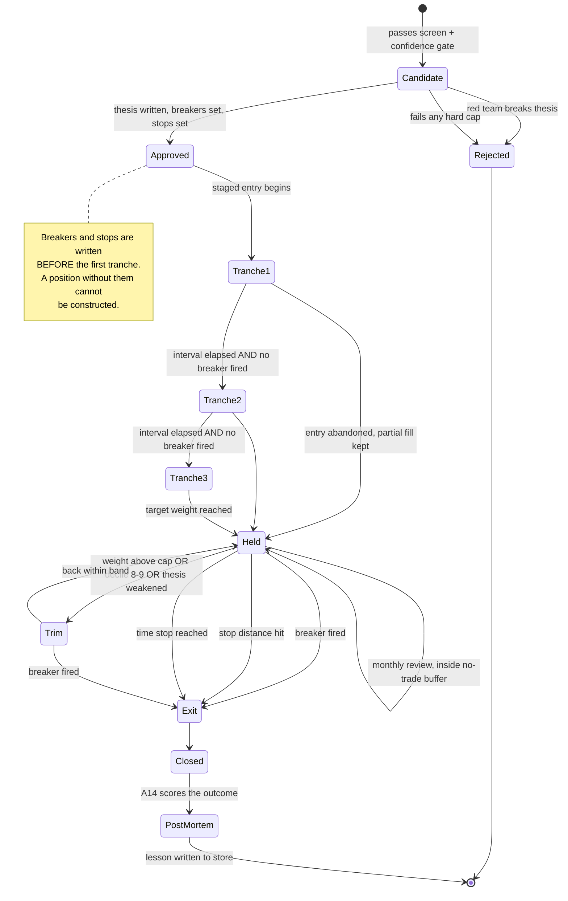
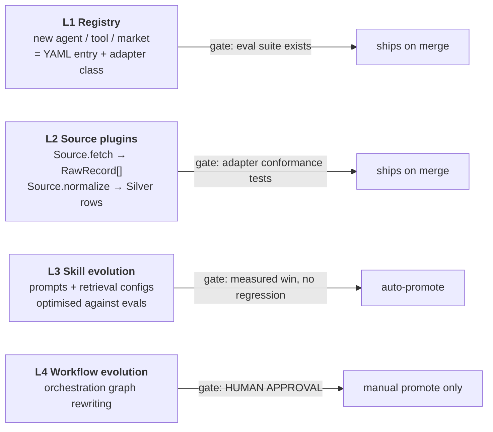

# Module 5 — The Analyst Mind

## System architecture for a multi-agent, multi-market equity research system

> **Status:** implementation plan, v1.0 · 24 Aug 2026
> **Relationship to existing docs:** this is the module that sits between `BUILD_PLAN.md` (infrastructure), `DECISION_ENGINE.md` (what to buy, how much) and `KNOWLEDGE_BASE.md` (what the system knows). Those three answer *what the system is built from*. This one answers **how the system reasons about a company, and why it believes a price moved.**
> **Not financial advice.** Nothing here recommends a transaction. The system emits candidacy bands, calibrated probabilities, attributions and constraints — with evidence chains — and never places an order.

---

## 0. What this module has to deliver

Six requirements, stated as acceptance criteria rather than aspirations.

| # | Requirement | Acceptance criterion |
|---|---|---|
| R1 | Understand how a company is actually analysed | The system reproduces a full analyst workup — business model, segment history, earnings quality, capital allocation, balance sheet, valuation, competitive position — with every number traced to a filing line item and an `as_of` |
| R2 | Work internationally, not just one country | A new exchange is onboarded by filling one adapter contract (§6 of `06-DATA-AND-KNOWLEDGE-SOURCES.md`) and passing its eval suite. No orchestrator code changes. Accounting regime, session calendar, lot size, fee schedule and disclosure regime are per-market data, never hardcoded |
| R3 | News within a five-year window | Rolling 5-year news corpus with hot/warm/cold tiers; every article carries `published_at`, entity links and five sentiment dimensions; retrieval is recency-filtered, not recency-hinted |
| R4 | Explain **why** a price moved — statistically, not narratively | Every explanation splits the move into market / sector / style / FX / idiosyncratic components **before** naming a cause, and reports an explicit *unexplained share*. A move that is 90% index beta is never given a company story |
| R5 | Don't put all the eggs in one basket | Concentration limits are enforced in code, in the sizing engine, as a hard block — not as prompt guidance. A decision object that breaches a cap cannot be constructed |
| R6 | Every agent has its own knowledge | Each agent owns a named corpus with its own store, chunking, refresh cadence, trust tier and eval suite. No agent retrieves from a global undifferentiated index |

---

## 1. The one-paragraph description

A supervisor routes a question to a team of specialist agents. Each specialist owns a private knowledge base and a private tool set, and answers only within its competence. Their typed, cited outputs converge on three synthesis agents — one that decomposes price moves into their statistical parts, one that writes the thesis, and one whose only job is to attack it. A portfolio pair then converts the surviving thesis into exposure constraints, and a learning pair scores what actually happened and writes the lesson back into the knowledge bases. Nothing reaches the user without passing a deterministic guardrail chain, and nothing reaches a broker at all.

---

## 2. Layer diagram



**Read the diagram as three assertions.**
1. Evidence agents never talk to each other. They talk to their own knowledge and emit typed facts. This is what stops the classic multi-agent failure where two agents synthesise a claim that neither's evidence supports.
2. Every path to the user passes `GOUT`. There is no debug path, no "quick look" path, no admin path that skips it.
3. The learning layer writes back into the knowledge plane. That is the only loop in the diagram, and it is deliberately the slowest one.

---

## 3. Agent org chart



**The Red Team gate is not decoration.** A10 and A11 use *different* model tiers and *different* retrieval instructions: A10 retrieves supporting evidence, A11 is explicitly prompted and tooled to retrieve contradicting evidence and structurally similar failures from the failure-case library (§2.11 of `02-AGENTS-AND-RAG.md`). A thesis that A11 breaks does not proceed to sizing. Measured over time, the fraction of theses A11 kills is a health metric: if it drops near zero, A11 has been captured and needs re-grounding.

---

## 4. Mapping to the reference framework you supplied

The uploaded diagram (multi-modal multi-agent prediction framework: *Summarizer → Analyst → Prediction Agent → Reward Agent → Reflection Agent*) is the correct skeleton. Here is the mapping, and — more importantly — the three places this design deliberately departs from it.

| Reference component | Here | Change |
|---|---|---|
| LLM Summarizer Agent (news) | **A4 News & Narrative** | Extracts five features (relevance, polarity, intensity, uncertainty, forwardness) rather than a summary. Summaries lose the dimensions that carry the signal |
| LLM Analyst Agent (candlestick chart) | **A3 Price & Technical** | Reads numeric OHLCV + indicator series, not chart *images*. Vision on candlesticks adds cost and a hallucination surface for information already available numerically. Charts are rendered *for the human*, not for the model |
| Prediction Agent inputs | **A0 plan → evidence bundle** | Same idea, but each input is a typed, cited object with an `as_of`, not free text |
| Prediction Agent → `[BUY / SELL / HOLD]`, position size 1–10 | **A10 Thesis → A13 Sizing** | **No verbs.** Bands (`accumulate / hold / trim / exit / no_signal`) and a size derived from five hard caps, not a 1–10 vibe scale. The band and the size are computed by different components on purpose |
| Reward Agent → *Trade Execution Tool* | **A14 Reflection & Calibration** | **The execution tool is removed.** The system is a one-way door: it never places an order. "Reward" is computed from a paper ledger and realised prices |
| Reflection Agent → short/medium-term reflections back into prompt | **A14 → lesson store + calibration panel** | Reflections are written to a queryable store with outcome labels and retrieved by relevance, not stuffed into every prompt. Prompt-stuffed reflections silently blow the context budget and bias toward recency |

**The three departures, stated plainly:**

1. **No execution.** A model that can place orders converts a calibration bug into a financial loss with no human in between.
2. **No point predictions.** The reference emits an action and a size. This system emits a distribution, a band and a binding constraint. The honest ceiling on short-horizon directional accuracy is roughly 53–56%; a UI that shows "BUY, size 8/10" implies a precision that does not exist.
3. **Attribution before prediction.** The reference framework has no component that asks *why the price moved*. That is the component with the best evidence behind it and the lowest hallucination risk, and here it is a first-class agent (A9) that runs whether or not any forecast is requested.

---

## 5. Request lifecycle — full sequence



**Note step 22–23.** Catalysts are matched to the *residual*, never to the raw return. This is the single most important line in the whole sequence: it is the mechanical reason the system cannot tell you a company-specific story about a day when the entire index fell.

---

## 6. Physical / deployment topology



Two hosts, not twelve. At this data volume — end-of-day plus 15-minute bars across a few thousand instruments, a five-year news corpus — the entire stack fits comfortably on two mid-size dedicated-vCPU boxes. Managed equivalents are priced in `08-COST-BREAKDOWN.md`; the short version is that managed vector + graph + timeseries costs roughly 6–10× the self-hosted equivalent at this scale and buys operational convenience you may not need for a single-tenant personal system.

**Scale-out trigger:** move Qdrant off the data host when the news collection passes ~15M chunks or p95 retrieval latency passes 400 ms, whichever comes first. Not before.

---

## 7. Core data model



Two fields carry more weight than the rest. `FUNDAMENTAL_FACT.known_at` is what makes every backtest honest — every historical query filters `known_at <= t`, never `period_end <= t`. `INSTRUMENT.delisted_at` being present and populated is what stops survivorship bias from deleting every catastrophic outcome from the record.

---

## 8. Position lifecycle state machine



---

## 9. Model tier routing

One choke point, four tiers, routed by task class — never by habit.

| Tier | Used for | Agents | Rule |
|---|---|---|---|
| `reason` | Thesis synthesis, red-team attack, multi-hop graph traversal, ambiguous attribution | A10, A11, A9 (hard cases only) | Never used for anything that could be a classifier |
| `balanced` | Default agent work: fundamentals reading, valuation commentary, catalyst matching | A1, A2, A5, A6, A7, A8, A12 | The workhorse. ~70% of calls |
| `cheap` | Classification, entity tagging, routing, dedup, summarisation of routine items | A0 routing, A4 bulk news, ingest pipelines | ~80% of *volume*, ~10% of *cost* |
| `local` | Sentiment scoring, reranking, embedding | FinBERT + cross-encoder reranker on the app host | Zero marginal cost; run first, escalate only the tail |
| `embed` | Vector generation | All ingest | Cache by content hash — never re-embed unchanged text |

**Escalation, not default.** A4 processes thousands of articles a day. The pipeline is: rule filter → local FinBERT → `cheap` tier for the ones that pass relevance → `balanced` only for articles attached to a holding or a live candidate. Sending every article to a reasoning model is how a personal project generates an enterprise invoice.

---

## 10. Growth surface — how the system gets wider without a rewrite

Four layers, ordered by blast radius. Each has a different promotion gate.



**The ratchet rule:** a capability ships only with an eval suite, and promotion requires no regression on existing suites. L4 — a system rewriting who calls whom — is the layer that can quietly ruin you, and it never auto-promotes.

**Fitness function**, computed nightly from the provenance ledger:

```
fitness = w1·groundedness
        + w2·citation_validity
        + w3·refusal_precision
        + w4·attribution_accuracy      ← new in this module
        + w5·forecast_calibration (Brier)
        − w6·p95_latency
        − w7·cost_per_query
```

`attribution_accuracy` is measured against a human-labelled set of ~200 historical moves with known causes (earnings dates, announced M&A, index rebalances — cases where the cause is not in dispute). It is the only new term, and it is the one that keeps A9 honest.

---

## 11. Repository layout

```
finance-agent/
├─ docs/                        ← this plan
├─ apps/
│  ├─ api/                      FastAPI gateway + guardrail chain
│  └─ web/                      Next.js · annotated charts · cards
├─ agents/
│  ├─ registry.yaml             capability registry — the growth surface
│  ├─ supervisor/               A0
│  ├─ evidence/                 A1–A8, one package each
│  ├─ synthesis/                A9 attribution · A10 thesis · A11 red team
│  ├─ portfolio/                A12 risk · A13 sizing
│  └─ learning/                 A14 reflection · A15 teacher
├─ knowledge/
│  ├─ collections/              one module per Qdrant collection
│  ├─ ingest/                   per-source adapters
│  ├─ chunking/                 per-corpus strategies
│  ├─ retrieval/                hybrid · RRF · rerank · grade
│  ├─ graph/                    Neo4j schema + traversal
│  └─ evals/                    per-corpus eval suites
├─ engines/
│  ├─ attribution/              factor model · event matching · decomposition
│  ├─ factors/                  point-in-time factor library
│  ├─ risk/                     concentration · correlation · stress · drawdown
│  ├─ sizing/                   waterfall · five caps · Kelly gate · vol target
│  └─ backtest/                 purged walk-forward · cost model · DSR
├─ markets/
│  ├─ contract.py               MarketAdapter ABC
│  ├─ xkls.py xnas.py xses.py … one per exchange
│  └─ calendars/                session + holiday data
├─ core/
│  ├─ llm/                      tier router — single inference choke point
│  ├─ guardrails/               input · retrieval · tool · output rails
│  ├─ provenance/               append-only ledger
│  ├─ contracts/                Pydantic models shared across agents
│  └─ observability/
└─ infra/                       compose · terraform · cron
```

---

## 12. Reading order for the rest of this plan

| Doc | Answers |
|---|---|
| `02-AGENTS-AND-RAG.md` | Every agent, its private knowledge base, retrieval config, tools, output contract and eval |
| `03-WHY-IT-MOVED.md` | The attribution engine — short-window statistics, catalyst matching, long-horizon return decomposition |
| `04-ANALYST-METHOD.md` | The craft, codified: how a company is actually analysed, step by step, with what each step can and cannot tell you |
| `05-RISK-AND-GUARDRAILS.md` | Risk management, concentration enforcement, drawdown governance, the full guardrail chain |
| `06-DATA-AND-KNOWLEDGE-SOURCES.md` | International coverage ladder, per-market adapter contract, every source and its refresh cadence |
| `07-BUILD-ORDER.md` | Phases, deliverables, definition of done, what to cut if time runs out |
| `08-COST-BREAKDOWN.md` | Full cost model at three tiers, with the token math shown |
| `09-RESEARCH-SOURCES.md` | Every source behind the design decisions above |
