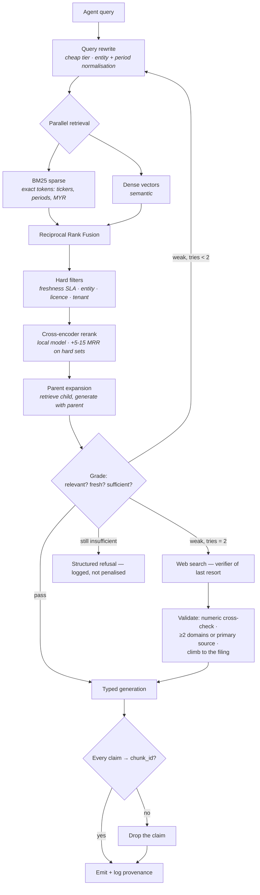

# 02 — Agents and their private knowledge bases

Sixteen components. Each evidence agent owns exactly one primary knowledge collection, plus read access to a small set of shared stores. **No agent queries a global undifferentiated index.** That rule exists because heterogeneous corpora poison each other: a semantic search for "margin compression risk" across one index containing both a textbook definition and last Tuesday's news returns the textbook, and the answer cites a definition as evidence for a valuation claim.

---

## 1. The knowledge plane at a glance

```mermaid
flowchart TB
    subgraph QD["Qdrant — 9 named collections"]
        K1["kb_filings<br/><i>parent-child, 5y+</i>"]
        K2["kb_news<br/><i>5y rolling, recency-filtered</i>"]
        K3["kb_transcripts<br/><i>speaker-turn</i>"]
        K4["kb_sector<br/><i>industry primers, S-curves</i>"]
        K5["kb_craft<br/><i>investing method, curriculum-tagged</i>"]
        K6["kb_failures<br/><i>blowup case library</i>"]
        K7["kb_method_valuation<br/><i>valuation techniques + peer bands</i>"]
        K8["kb_method_technical<br/><i>patterns + MEASURED base rates</i>"]
        K9["kb_lessons<br/><i>own post-mortems</i>"]
    end

    subgraph TSDB["TimescaleDB"]
        T1["price_bars"]
        T2["fundamental_facts (known_at)"]
        T3["fx_rates"]
        T4["macro_series"]
        T5["factor_returns"]
        T6["event_base_rates"]
    end

    subgraph NEO["Neo4j"]
        G1["Company · Sector · Country · Product"]
        G2["supplies · competes · owns · exposed_to"]
        G3["Event nodes linked to entities"]
    end

    subgraph PG["Postgres — tenant-private, NEVER embedded"]
        P1["ledger · holdings · goals"]
        P2["decision_journal"]
        P3["provenance_ledger"]
    end

    A1["A1 Fundamentals"] --> K1 & T2
    A2["A2 Valuation"] --> K7 & T2 & T1
    A3["A3 Price &amp; Technical"] --> K8 & T1
    A4["A4 News &amp; Narrative"] --> K2
    A5["A5 Catalyst &amp; Events"] --> T6 & K1
    A6["A6 Macro &amp; Regime"] --> T4 & T3
    A7["A7 Sector &amp; Technology"] --> K4 & NEO
    A8["A8 Ownership &amp; Flow"] --> T2 & K1
    A9["A9 Attribution"] --> T5 & T1 & T6
    A10["A10 Thesis"] --> K3
    A11["A11 Red Team"] --> K6
    A12["A12 Risk"] --> T1 & P1
    A13["A13 Sizing"] --> P1
    A14["A14 Reflection"] --> K9 & P2
    A15["A15 Teacher"] --> K5
```



**Trust hierarchy — enforced at merge time, not suggested in a prompt.**

```
Tenant ledger (P1)  >  Market series (T1–T5)  >  Filings (K1)  >  Method KBs (K5,K7,K8)
                    >  Transcripts (K3)  >  Curated news (K2)  >  Web search
```

A web result may never overwrite a value from a filing or a price series. When they disagree, the disagreement is surfaced to the user as a finding — it is information, not noise to be silently resolved.

---

## 2. Agent specifications

Each card is the build spec. `Refresh` is what the scheduler runs; `Store` is where the knowledge lives; `Retrieval` is the exact configuration, because retrieval strategy affects output quality more than model size does in finance RAG.

---

### A0 — Supervisor

| | |
|---|---|
| **Job** | Classify intent, build an execution plan, allocate a token budget, pick a model tier, and refuse when the question is out of scope |
| **Knowledge** | `registry.yaml` (capability registry) + routing policy table + the user's memory record (risk tolerance, constraints such as shariah-only, horizon, past decisions) |
| **Store** | Postgres (memory), YAML loaded at boot (registry) |
| **Source** | Internal. The registry is the growth surface — a new market or agent is a YAML entry plus an adapter class |
| **Refresh** | Registry on deploy; memory on every interaction |
| **Retrieval** | Exact lookup, no vectors. Intent classification runs on the `cheap` tier with a fixed label set |
| **Tools** | `plan()`, `budget()`, `route()`, `refuse()` |
| **Output** | `Plan{steps[], agents[], budget_tokens, tier, deadline}` |
| **Guardrail** | Cannot route a question to an agent whose data is stale beyond its SLA. Cannot exceed the per-user daily token budget — the plan is truncated, and the truncation is disclosed |
| **Eval** | Routing accuracy on a labelled set of 300 questions; budget adherence; refusal precision on 50 deliberately out-of-scope questions |

---

### A1 — Fundamentals Agent

| | |
|---|---|
| **Job** | Read the financial statements. Reconstruct segment history, earnings quality, capital allocation, balance-sheet resilience — as reported, at the time it was knowable |
| **Knowledge** | **`kb_filings`** — annual and interim reports, 10-K/10-Q/8-K, Bursa/SGX/HKEX announcements + **`fundamental_facts`** (Timescale, `known_at`-stamped) |
| **Store** | Qdrant `kb_filings` + S3 raw + TimescaleDB facts |
| **Source** | SEC EDGAR `companyfacts` (public domain, free, 10 req/s with a User-Agent header) · exchange announcement feeds · a point-in-time fundamentals vendor for the US universe · **self-built `known_at` store for Bursa** — no vendor supplies it |
| **Refresh** | Filings: event-driven, polled daily. Facts: on filing acceptance. Restatements append a new row, never update in place |
| **Chunking** | **Parent–child hierarchical.** Parent = structural section (SEC "Item 7", Bursa announcement section, note to accounts), ≤2,000 tokens. Child = ~300 tokens, 15% overlap. **Retrieve on children, generate with the parent.** Financial tables converted to markdown before chunking |
| **Retrieval** | Hybrid BM25 + dense, fused with Reciprocal Rank Fusion, then cross-encoder rerank. Hard filters on `company`, `fiscal_period`, `accounting_std`. Exact-token matching matters here — "Q3 FY25", "0011.KL", segment names |
| **Metadata** | `company · fiscal_period · period_end · filed_at · known_at · section · accounting_std · currency · doc_type · language` |
| **Tools** | `get_statement(concept, periods)` · `segment_history()` · `dupont()` · `accrual_ratio()` · `piotroski_f()` · `cash_conversion()` · `restatement_diff()` |
| **Output** | `FundamentalsReport{line_items[], quality_flags[], segment_series[], citations[], as_of}` |
| **Guardrail** | Never mixes accounting standards in a comparison without normalising and saying so. Never quotes a restated figure when asked what was knowable at time *t*. Every number carries `(value, currency, period_end, known_at, source_doc_id)` |
| **Eval** | 100 hand-checked line items across 5 markets; restatement-handling suite; a lookahead trap suite where the naive `period_end` join produces a knowably wrong answer |

> **Build note.** DIY point-in-time from EDGAR XBRL is free but is genuinely fiddly work, not an afternoon: tag drift over time (one large-cap's revenue has lived under three different tags since 2014), stub periods leaking into annual figures, and reconstructing first-reported values through restatements. Buy the US universe; build Malaysia and the ASEAN markets yourself from announcement dates. Budget for this — it is the single largest unglamorous block in the project.

---

### A2 — Valuation Agent

| | |
|---|---|
| **Job** | Convert fundamentals into a value range — never a target price. Multiples in context, reverse-DCF, sector-relative bands |
| **Knowledge** | **`kb_method_valuation`** — valuation techniques, when each applies and when it breaks, sector-specific conventions (banks on P/B and ROE, REITs on FFO, cyclicals on mid-cycle earnings, pre-profit names on revenue multiples with the caveat stated) + **historical multiple bands** per instrument and per sector-market |
| **Store** | Qdrant `kb_method_valuation` (~1,500 concept chunks) + TimescaleDB derived band series |
| **Source** | Tier A public-domain material (SEC / Investor.gov investor publications, academic papers by DOI) + **Tier C system-generated concept notes**, grounded in Tier A with citations, reviewed once by you, then frozen as canonical |
| **Refresh** | Method notes: annual review (`reviewed_at`, not `published_at` — a definition does not go stale in six hours). Multiple bands: nightly recompute |
| **Chunking** | One concept per chunk, ~500 tokens, self-contained. Method chunks must stand alone — they are retrieved individually |
| **Retrieval** | Dense-heavy (conceptual queries are semantic), BM25 for exact term lookup. Filter on `sector_applicability` so bank methods are never retrieved for a software company |
| **Metadata** | `concept · sector_applicability[] · prerequisite[] · licence · source_tier · reviewed_at` |
| **Tools** | `multiple_vs_history(band=[5y,10y])` · `peer_multiples(peer_set)` · `reverse_dcf()` · `dcf(scenarios)` · `sum_of_parts()` · `implied_growth()` |
| **Output** | `ValuationView{method, range_low, range_base, range_high, implied_assumptions[], sensitivity[], caveats[], citations[]}` |
| **Guardrail** | Emits **ranges and implied assumptions**, never a point target. Reverse-DCF is mandatory alongside any forward DCF — stating what the *current price* implies is more honest than stating what you think it is worth. Refuses DCF for financials and early-stage names, and says why |
| **Eval** | Method-selection correctness across 60 companies spanning 8 sector archetypes; band reproduction against hand calculations; a suite asserting no point target ever appears in output |

---

### A3 — Price & Technical Agent

| | |
|---|---|
| **Job** | Describe what price and volume actually did — trend, volatility regime, liquidity, distance from moving averages, drawdown, relative strength — with measured base rates, not folklore |
| **Knowledge** | **`kb_method_technical`** — indicator and pattern definitions, each **paired with the system's own measured base rate** in that market and cap band. A pattern with no measured base rate is marked `unvalidated` and cannot be cited as evidence |
| **Store** | Qdrant `kb_method_technical` (~600 chunks) + TimescaleDB `price_bars`, `factor_returns` |
| **Source** | Public-domain method descriptions + **base rates computed by the system itself** from its own survivorship-safe history |
| **Refresh** | Base rates recomputed quarterly on an expanding window; definitions annually |
| **Chunking** | One indicator/pattern per chunk with its base-rate table attached as structured metadata |
| **Retrieval** | Exact lookup by indicator name; dense only for "what does X mean" questions |
| **Tools** | `ohlcv(window)` · `atr(n)` · `realised_vol(n)` · `drawdown()` · `relative_strength(vs=index)` · `volume_anomaly()` · `gap_stats()` · `regime_label()` · `base_rate(pattern, market, cap_band)` |
| **Output** | `PriceContext{trend, vol_regime, liquidity_adv20, dist_from_ma, drawdown_from_high, rs_vs_index, notable_patterns[{name, base_rate_n, base_rate_hit, unvalidated}]}` |
| **Guardrail** | **Never predicts from a pattern.** It reports the historical conditional distribution and its sample size. A pattern with n < 30 is reported with the sample size in the same sentence. Short-horizon signals are suppressed within 3 sessions of a scheduled earnings date — event risk dominates every technical feature, and the model will otherwise learn a spurious pattern |
| **Eval** | Indicator values against a reference implementation; base-rate reproduction; an assertion suite that no output contains a directional prediction |

> **Why numeric, not vision.** The reference framework feeds candlestick *images* to a vision model. Everything in a candlestick chart is present in the OHLCV series at higher fidelity and lower cost. Charts are rendered for the human, annotated by A9. The model reads numbers.

---

### A4 — News & Narrative Agent

| | |
|---|---|
| **Job** | Turn five years of global news into structured, citable features attached to entities and dates |
| **Knowledge** | **`kb_news`** — rolling 5-year corpus, multilingual, entity-linked |
| **Store** | Qdrant `kb_news` (hot: 12 months, in-memory; warm: 12–60 months, on-disk with quantization; cold: >60 months, archived to S3 and dropped from the index) + TimescaleDB for the derived feature series |
| **Source** | **GDELT 2.0** as the free, unlimited backbone — 15-minute cadence, 100+ languages, events coded into ~300 categories, georeferenced, with a Global Knowledge Graph resolving persons, organisations, locations, themes and tone. **WorldMonitor** as the curated higher-trust layer (synthesised briefs, Country Instability Index, market composite). A per-ticker news API for company-level coverage. An **article-level** sentiment source for anything that must be cited |
| **Refresh** | GDELT every 15 min · WorldMonitor every 5 min · company news real-time · nightly backfill reconciliation |
| **Chunking** | Whole article if under ~1,000 tokens; otherwise lead + section chunks. Never split a quote from its attribution |
| **Retrieval** | Hybrid, **recency as a hard filter not a rerank hint**, plus entity and country filters. Dedup by near-duplicate hash before indexing — wire stories replicate across hundreds of domains and will otherwise dominate any top-k |
| **Metadata** | `source · domain · published_at · language · countries[] · instruments[] · sectors[] · gdelt_themes[] · tone · doc_hash · source_reliability` |
| **Feature extraction** | **Five dimensions, not one polarity score:** `relevance · polarity · intensity · uncertainty · forwardness`. The evidence is that intensity and uncertainty carry more predictive weight than polarity. Extracted by local FinBERT first, escalated to an LLM only for articles attached to a holding or live candidate — the two are complementary rather than redundant |
| **Tools** | `search_news(entity, window, filters)` · `extract_features(doc)` · `tone_delta(entity, window)` · `narrative_shift(entity)` · `source_reliability(domain)` |
| **Output** | `NewsEvidence{articles[{id, url, published_at, features{5}, entities[]}], aggregate{tone_delta, volume_z, uncertainty_mean}, citations[]}` |
| **Guardrail** | **Never asked "will this stock go up".** It extracts features from text; a supervised model consumes them downstream. This also sidesteps look-ahead: feature extraction from a document does not require the model to know the outcome. Company-level aggregate sentiment scores that cannot be traced to a specific headline are usable as a *feature* and never as *evidence* |
| **Eval** | Entity-linking precision/recall on 500 labelled articles; dedup effectiveness; five-dimension inter-rater agreement against a human-labelled set of 200; per-domain reliability tracked over time |

> **The look-ahead trap with your name on it.** Any LLM-derived feature used in a backtest must come from a model whose training cutoff *precedes* the label window — otherwise the model has the outcome in its weights and the backtest measures memory, not skill. Where that cannot be guaranteed, restrict the backtest to a post-cutoff window and accept the shorter sample. A second documented bias, the *distraction effect*, is that extraneous company information skews the sentiment read — which is the argument for narrow, structured extraction prompts over "read this and tell me what you think".

---

### A5 — Catalyst & Events Agent

| | |
|---|---|
| **Job** | Maintain a time-indexed catalogue of everything that could move a price, and know what each event type has historically been worth |
| **Knowledge** | **`event_base_rates`** — the system's own table of historical abnormal-return distributions by `event_type × market × cap_band × surprise_bucket`. This is the most valuable knowledge base in the system and no vendor sells it |
| **Store** | TimescaleDB `corporate_events` + `event_base_rates` · Qdrant `kb_filings` for announcement text |
| **Source** | Exchange announcement feeds · earnings calendars · SEC Forms 4/13D/13G · index provider rebalance notices · dividend and corporate-action feeds · short-interest reports · litigation and regulator dockets |
| **Refresh** | Calendars daily · announcements event-driven · base rates recomputed quarterly on expanding windows |
| **Event taxonomy** | `earnings_result · guidance_change · m&a_target · m&a_acquirer · buyback · dividend_change · capital_raise · insider_buy · insider_sell · index_add · index_drop · rating_change · contract_win · product_launch · regulatory_action · litigation · executive_change · going_concern · halt · delisting · short_squeeze_setup · lockup_expiry` |
| **Retrieval** | Time-range + entity SQL. Announcement bodies via `kb_filings` hybrid search |
| **Tools** | `events_in_window(instrument, t0, t1)` · `base_rate(event_type, market, cap_band)` · `surprise(actual, consensus)` · `next_scheduled(instrument)` · `blackout_check(instrument)` |
| **Output** | `EventSet{events[{type, announced_at, effective_at, details, surprise, source}], base_rates[{type, n, median_car, iqr}], next_scheduled}` |
| **Guardrail** | `announced_at` and `effective_at` are separate fields and are never conflated. Events with no primary-source document are marked `unconfirmed` and cannot be cited as a cause. The base-rate table reports `n` alongside every median — a median CAR from 6 observations is presented as such |
| **Eval** | Calendar completeness against a reference for 200 company-quarters; announcement-timestamp accuracy; base-rate stability across resampling |

---

### A6 — Macro & Regime Agent

| | |
|---|---|
| **Job** | Establish the conditions everything else is happening inside — rates, inflation, FX, commodities, country stress, market regime |
| **Knowledge** | `macro_series` + regime definitions + a labelled history of past regime transitions |
| **Store** | TimescaleDB `macro_series`, `fx_rates` |
| **Source** | FRED and World Bank/IMF series (permissive, free) · central bank calendars · WorldMonitor Country Instability Index and 7-signal market composite · commodity and energy series |
| **Refresh** | Series on publication schedule · FX hourly · CII and composite every 5 min |
| **Retrieval** | Direct series lookup with as-of semantics. No vectors |
| **Tools** | `series(code, window)` · `regime_label(date)` · `rate_path()` · `fx_path(pair)` · `country_stress(code)` · `regime_history(label)` |
| **Output** | `MacroContext{regime: risk_on|neutral|risk_off, rate_direction, fx_moves[], country_stress[], upcoming_prints[], as_of}` |
| **Guardrail** | Regime labels are descriptive and carry the rule that produced them. **Never forecasts a rate decision.** Feeds the Country Instability Index and the market composite downstream as *separate* features — mixing pre-synthesised signals into a single polarity score destroys their independence |
| **Eval** | Regime-label stability; series freshness compliance; correct as-of handling across revisions (macro series get revised — the first print and the revision are different rows) |

---

### A7 — Sector & Technology Agent

| | |
|---|---|
| **Job** | Explain the industry a company lives in, where it sits in the value chain, and what technology or capex cycle is currently reshaping it. This is the agent that answers "did they *do* something, or did their *industry* change?" |
| **Knowledge** | **`kb_sector`** — industry primers, unit economics by business model, S-curve and adoption-cycle notes, capex-cycle history, regulatory structure per sector per country + **the Neo4j graph** for supply-chain and competitive edges |
| **Store** | Qdrant `kb_sector` (~4,000 chunks) + Neo4j |
| **Source** | Tier A public-domain material · company filings (segment disclosures and risk factors are the best free industry-structure source that exists) · patent and standards-body announcements · Tier C system-generated primers, reviewed once, frozen |
| **Refresh** | Primers reviewed quarterly · graph edges continuously as filings and news are ingested |
| **Chunking** | Concept-level ~500 tokens, tagged to a sector node and a value-chain position |
| **Retrieval** | Dense for concepts; **graph traversal for the multi-hop questions vector search cannot answer** — `event → country → sector → supplier → my holding` |
| **Graph schema** | Nodes: `Company · Sector · SubSector · Country · Product · Technology · Commodity · Regulator`. Edges: `supplies · competes_with · customer_of · owns · operates_in · exposed_to · substitutes · regulated_by`, each carrying `weight`, `source`, `as_of` |
| **Tools** | `sector_primer(code)` · `value_chain(instrument)` · `peers(instrument, method)` · `traverse(from, to, max_hops)` · `tech_cycle(sector)` · `capex_cycle(sector)` |
| **Output** | `SectorContext{structure, position_in_chain, peers[], substitution_risks[], cycle_stage, traversal_paths[{path, hops, decay}]}` |
| **Guardrail** | **Every multi-hop claim ships with its traversal path attached and a path-decay weight.** A 3-hop inference is visibly weaker than a direct link, and the UI renders it as such. An impact claim without a path cannot be emitted |
| **Eval** | Peer-set agreement against a reference classification; traversal precision on 100 known supply-chain relationships; primer factual accuracy spot-check |

---

### A8 — Ownership & Flow Agent

| | |
|---|---|
| **Job** | Answer "who is buying and who is selling, and does anyone here know something?" |
| **Knowledge** | Ownership and flow tables + insider-transaction history, with the base rates for each |
| **Store** | TimescaleDB `ownership_snapshots`, `insider_transactions`, `short_interest` |
| **Source** | SEC Forms 3/4/5, 13D/13G, 13F · exchange substantial-shareholder notices (Bursa, SGX, HKEX all mandate these) · short-interest reports · buyback announcements and actual execution disclosures |
| **Refresh** | Filings event-driven · 13F quarterly (with the 45-day lag treated as a hard `known_at`) · short interest per market schedule |
| **Retrieval** | SQL by entity and window |
| **Tools** | `insider_activity(instrument, window)` · `ownership_change(instrument)` · `buyback_actual_vs_announced()` · `short_interest_trend()` · `concentration_of_register()` |
| **Output** | `FlowContext{insider_net, insider_cluster_flag, top_holder_changes[], buyback_execution_rate, short_interest_pct_float, days_to_cover}` |
| **Guardrail** | 13F data is 45+ days stale by construction — every 13F-derived claim carries that lag on its face. **Insider selling is explicitly not treated as a signal by default**: scheduled plans, tax and diversification dominate the sample. Only *cluster buying* and *non-plan* selling are flagged, and both with their base rates |
| **Eval** | Filing-parse accuracy; buyback reconciliation against cash-flow statements; a suite asserting the 13F lag is disclosed in every output that uses it |

---

### A9 — Attribution Agent

| | |
|---|---|
| **Job** | **The core of this module.** Decompose any price move into market, sector, style, currency and idiosyncratic components; then, and only then, match catalysts to the residual |
| **Knowledge** | `factor_returns` (own computed daily factor series per market) · peer-set registry · `event_base_rates` · `kb_news` |
| **Store** | TimescaleDB + read access to A4's and A5's collections |
| **Refresh** | Factor returns nightly · betas re-estimated weekly on trailing 250 sessions |
| **Retrieval** | Numeric first. Text retrieval is scoped to the event window, entity-filtered |
| **Tools** | `decompose(instrument, window)` · `abnormal_return(instrument, window)` · `candidate_causes(instrument, window)` · `score_candidates()` · `long_horizon_decompose(instrument, years)` |
| **Output** | `MoveExplanation` — full contract in `03-WHY-IT-MOVED.md` §7 |
| **Guardrail** | **Three hard rules.** (1) Components are computed before any narrative is generated. (2) Catalysts are matched to the residual, never the raw return. (3) `unexplained_share` is always reported, and when the top candidate scores below threshold the output is *"no identified catalyst"* — which is a real and common answer, not a failure |
| **Eval** | Attribution accuracy against ~200 human-labelled moves with undisputed causes (earnings dates, announced M&A, index rebalances); a negative suite of 50 pure-beta days where the correct answer is "the market moved"; regression-stability checks |

---

### A10 — Thesis Agent

| | |
|---|---|
| **Job** | Assemble the evidence into a written thesis with named drivers, an explicit horizon, and 2–4 **falsifiable** breakers |
| **Knowledge** | **`kb_transcripts`** — earnings calls and guidance, chunked by speaker turn |
| **Store** | Qdrant `kb_transcripts` |
| **Source** | Earnings call transcripts and webcasts · guidance statements · capital-markets-day materials |
| **Refresh** | Event-driven, within 48h of the call |
| **Chunking** | Speaker turn, merged to ~600 tokens. Never merge across speakers — the identity of who said something is half the signal |
| **Metadata** | `company · quarter · speaker · role · timestamp · segment · is_qna` |
| **Retrieval** | Hybrid with a `role` filter — management answers in Q&A behave differently from the prepared statement, and the distinction matters |
| **Tools** | `transcript_search(company, quarter, query)` · `guidance_language_delta(q1, q2)` · `question_evasion_score()` · `draft_thesis(evidence_bundle)` |
| **Output** | `Thesis{claim, horizon, drivers[{name, evidence[], sign, weight}], breakers[{condition, check_method, data_source}], valuation_anchor, confidence, citations[]}` |
| **Guardrail** | **A breaker that cannot be automatically checked is rejected at construction time.** "Management execution disappoints" is not a breaker. "ROIC below 8% for two consecutive quarters", "net debt/EBITDA above 4×", "loses the X concession" are breakers, because each maps to a query the system runs on every fundamentals update |
| **Eval** | Breaker checkability — 100% must map to an executable query, enforced in CI; citation validity; driver-to-evidence traceability |

---

### A11 — Red Team Agent

| | |
|---|---|
| **Job** | Try to destroy the thesis. Retrieve disconfirming evidence and structurally similar historical failures |
| **Knowledge** | **`kb_failures`** — a curated library of blowups, frauds, value traps and thesis failures, each tagged with the *structural pattern* that preceded it: aggressive accruals, serial acquirers, receivables growing faster than revenue, related-party dependence, single-customer concentration, covenant cliffs, going-concern language, auditor changes, cyclical peak margins mistaken for structural |
| **Store** | Qdrant `kb_failures` (~800 case chunks) |
| **Source** | Public enforcement actions and litigation releases (public domain) · delisting and restatement records · academic case literature by DOI · Tier C system-written case notes grounded in primary filings |
| **Refresh** | Quarterly additions; each new case reviewed once and frozen |
| **Chunking** | One case per parent, pattern-tagged children of ~400 tokens |
| **Retrieval** | **Similarity search on the structural pattern vector, not the company.** The question is "what does this situation resemble", not "who else is in this sector" |
| **Tools** | `find_analogues(fundamentals_profile)` · `disconfirming_search(thesis)` · `check_accounting_flags()` · `stress_the_driver(driver)` · `survivorship_check(universe)` |
| **Output** | `RedTeamVerdict{verdict: survives|weakened|broken, attacks[{claim, evidence, severity}], analogues[{case, pattern, outcome}], residual_risks[]}` |
| **Guardrail** | Runs on the `reason` tier with a retrieval configuration that **excludes** the evidence A10 used, so it cannot simply agree. It has no access to A10's reasoning text — only to the thesis claims. If it returns `survives` on more than ~85% of theses over a rolling quarter, it is flagged as captured and re-grounded |
| **Eval** | Detection rate on 50 known historical failures presented as if live at time *t* (using `known_at` data only); false-positive rate on 50 known long-term compounders |

---

### A12 — Risk & Portfolio Agent

| | |
|---|---|
| **Job** | Measure what the portfolio actually is — exposures, concentration, correlation structure, drawdown, and behaviour under stress |
| **Knowledge** | Portfolio state (Postgres) + covariance and correlation estimates + a scenario library of historical stress episodes |
| **Store** | Postgres (tenant-private) + TimescaleDB (returns) |
| **Source** | Own holdings and ledger · own price history · historical crisis windows for scenario replay |
| **Refresh** | Positions live · covariance nightly on a 2-year window with exponential decay · scenarios static, reviewed annually |
| **Retrieval** | SQL only. **Personal financial data is never embedded and never enters a shared index or an outbound web query** |
| **Tools** | `exposures()` · `hhi()` · `effective_bets()` · `correlation_clusters()` · `var_es(horizon, confidence)` · `stress(scenario)` · `drawdown_state()` · `factor_tilt()` |
| **Output** | `RiskSnapshot{weights[], hhi, effective_n, cluster_map, currency_exposure, country_exposure, sector_exposure, var_95, es_97_5, stress_results[], drawdown_pct, drawdown_days}` |
| **Guardrail** | Reports **effective number of bets** alongside position count — ten holdings that all move together is one bet wearing ten hats, and this is precisely the "eggs in one basket" failure that a naive count misses. VaR is always reported with Expected Shortfall beside it and with its assumptions named |
| **Eval** | Covariance-estimate stability; stress-scenario reproduction against known historical outcomes; correlation-cluster stability under resampling |

---

### A13 — Sizing Agent

| | |
|---|---|
| **Job** | Answer "how much, given everything I have and everything I owe" — and refuse when the answer is *nothing* |
| **Knowledge** | Planner state (cashflow, emergency floor, goals, liabilities) + the realised trade record that gates Kelly |
| **Store** | Postgres |
| **Retrieval** | SQL only |
| **Tools** | `investable_capital()` · `risk_budget_cap()` · `kelly_cap()` · `concentration_cap()` · `liquidity_cap()` · `cost_floor()` · `vol_target_scalar()` · `lot_round()` |
| **Output** | `SizingDecision{band, investable_capital, binding_cap, target_value, target_units, tranches[], stop_price, breakers[], time_stop, portfolio_after, goal_impact}` |
| **Guardrail** | Full detail in `05-RISK-AND-GUARDRAILS.md`. The short form: **the size is the minimum of five caps, and the emergency floor is never breachable.** Kelly stays disabled until 50–100 logged outcomes exist. `binding_cap` is always shown — knowing *which* constraint bound the size is more instructive than the number |
| **Eval** | Cap arithmetic against hand-worked examples; a property test asserting no output can breach any cap under any input; a suite of adversarial inputs (implausible edges, zero liquidity, negative investable capital) |

---

### A14 — Reflection & Calibration Agent

| | |
|---|---|
| **Job** | Score what actually happened, update calibration, and write lessons that later retrievals can find |
| **Knowledge** | **`kb_lessons`** — the system's own post-mortems + `decision_journal` (every accepted *and rejected* suggestion with the stated reason) |
| **Store** | Qdrant `kb_lessons` + Postgres `decision_journal`, `outcomes` |
| **Source** | Own decisions, own realised prices, own attribution outputs |
| **Refresh** | On every position close, on every forecast horizon expiry, and monthly in aggregate |
| **Chunking** | One lesson per chunk, tagged with the decision type, the error class and the concept exercised |
| **Retrieval** | Similarity on situation features, filtered by decision type. **Lessons are retrieved by relevance, not stuffed into every prompt** — prompt-stuffing reflections blows the context budget and biases toward whatever happened most recently |
| **Tools** | `score_outcome(decision_id)` · `brier(window)` · `reliability_curve(window)` · `regime_breakdown()` · `write_lesson()` · `kill_switch_check()` |
| **Output** | `Reflection{decision_id, realised, expected, error_class, attribution_of_error, lesson, concept_ref}` |
| **Guardrail** | Error attribution distinguishes **bad process from bad luck** — a well-reasoned decision with a poor outcome must not generate a "lesson" that degrades the process. Only decisions where the *reasoning* was falsified produce lessons. This distinction is the difference between learning and superstition |
| **Eval** | Brier score and reliability curve on the live record — both permanent UI elements, not hidden metrics; lesson-retrieval usefulness measured by whether retrieved lessons changed a later decision |

---

### A15 — Teacher Agent

| | |
|---|---|
| **Job** | Explain the concept behind whatever the user is looking at, at the right level, in the right order |
| **Knowledge** | **`kb_craft`** — the investing and trading curriculum, L1–L8, with a prerequisite graph |
| **Store** | Qdrant `kb_craft` |
| **Source** | **Tier A ingest** (public-domain investor education, academic papers) · **Tier B link-only** (free-to-read but not free-to-redistribute — store the URL and a topic tag, never the body) · **Tier C generated** concept notes, grounded in Tier A, reviewed once, frozen |
| **Refresh** | Annual review via `reviewed_at`. Freshness is not a retrieval filter here — a definition does not expire |
| **Chunking** | One concept, ~500 tokens, self-contained |
| **Metadata** | `curriculum_node · level(1-8) · prerequisite[] · licence · source_tier · reviewed_at` |
| **Retrieval** | Dense-heavy; BM25 for exact term lookup ("what is ATR"). **Filtered on `licence`** — a `link_only` chunk can surface its title and URL and never its body |
| **Curriculum** | L1–L3 foundations (industry structure, vehicles, instruments) · L4 portfolio construction · L5 risk and behaviour · L6 evidence and method · L7 market-specific mechanics · L8 craft of trading. **L5 and L6 matter more to outcomes than L1–L3 and are exactly what free educational content skips — prioritise them** |
| **Teaching modes** | (1) **Just-in-time** — a term appears in an analysis output, the concept is pulled inline. Learning attached to a live decision sticks. (2) **Guided ladder** — sequential L1→L8, gated by short checks. (3) **Post-mortem** — after a decision resolves, surface the concept it exercised and whether it was applied correctly |
| **Guardrail** | **Zero `link_only` bodies ever emitted — a hard gate tested in CI, not a metric.** KB-Craft explains what a decision rule *is*; it never becomes the justification for a trade. Education and recommendation are separate surfaces |
| **Eval** | Concept coverage against the curriculum map; prerequisite-ordering correctness; licence compliance (hard gate) |

---

## 3. The retrieval pipeline every agent shares

Individual configuration differs; the skeleton does not.



**Four properties this pipeline has that a naive one does not.**

1. **Sparse and dense together.** Finance queries are half semantic ("margin compression risk") and half exact-token ("MYR", "Q3 FY25", "0011.KL"). Dense-only retrieval loses the second half. Fusing BM25 with dense embeddings via RRF beats either alone, and a cross-encoder reranker on top adds meaningfully on hard sets.
2. **Freshness is a filter, not a hint.** A reranker that merely *prefers* recent documents will still surface last year's guidance when this quarter's exists.
3. **Web search is triggered, never default.** It fires only on grader insufficiency after retry, an explicit freshness demand, a validation check on a high-impact claim, or an entity absent from the graph. Results are the lowest-trust tier and can never override a filing or a price series.
4. **Claim-to-chunk attribution is mandatory.** The characteristic agentic-RAG failure is an agent combining two chunks about different things into a claim supported by neither. Requiring every claim to name its chunk removes most synthesis hallucinations, and it is why the pipeline ends with a drop step rather than a hedge step.

---

## 4. Knowledge freshness SLAs

Every agent-visible fact carries `as_of`. Past its class SLA, the agent must either say so explicitly or refuse — silently serving stale data is the failure mode that destroys trust fastest.

| Collection | SLA | On breach |
|---|---|---|
| `price_bars` (intraday) | 20 min during session | Label "delayed", show the timestamp |
| `price_bars` (EOD) | 1 session | Refuse point-in-time claims, allow historical |
| `fundamental_facts` | 24h post-filing | Warn, proceed |
| `kb_news` | 30 min | Warn, proceed |
| `kb_filings` | 24h | Warn, proceed |
| `event_base_rates` | 1 quarter | Proceed (slow-moving by design) |
| `macro_series` | Per series schedule | Refuse regime claims if the driving series is stale |
| `kb_craft`, `kb_method_*` | `reviewed_at` within 12 months | Flag for review, proceed |
| `holdings`, `ledger` | Live | Hard refuse — never guess a position |

---

## 5. What each agent may *not* do

A single table, because it is the most-violated part of any agent design.

| Agent | Forbidden |
|---|---|
| A1 | Quote a restated figure as what was knowable at time *t*; compare across accounting standards without normalising |
| A2 | Emit a point price target; DCF a bank or a pre-revenue company |
| A3 | Predict direction from a pattern; emit a signal inside an earnings blackout window |
| A4 | Answer "will this go up"; cite an untraceable aggregate sentiment score as evidence |
| A5 | Conflate announcement and effective dates; cite an unconfirmed event as a cause |
| A6 | Forecast a central bank decision |
| A7 | Emit a multi-hop claim without its traversal path |
| A8 | Treat routine insider selling as a signal; use 13F data without disclosing its lag |
| A9 | Name a cause before computing components; match a catalyst to a raw return |
| A10 | Write a breaker that cannot be checked by a query |
| A11 | See A10's reasoning text; retrieve from A10's evidence set |
| A12 | Embed tenant data; report position count as a diversification measure |
| A13 | Breach any cap; enable Kelly below the trade-count gate; touch the emergency floor |
| A14 | Generate a lesson from a bad *outcome* where the *process* was sound |
| A15 | Emit the body of a `link_only` source; justify a trade with an educational concept |
| All | Place an order. There is no execution tool anywhere in the system |
