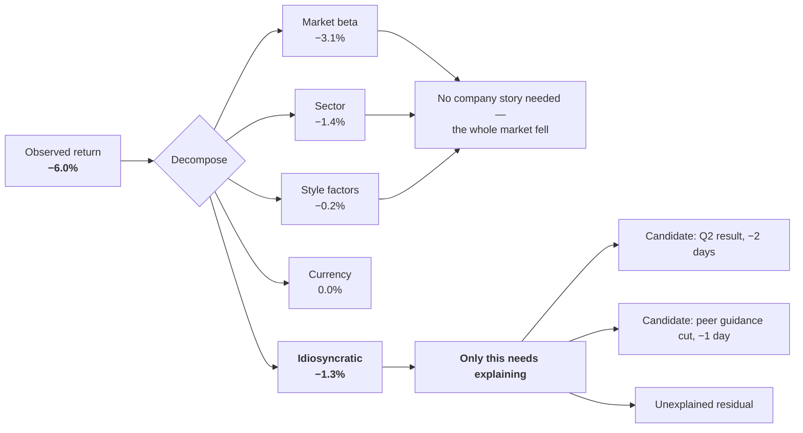
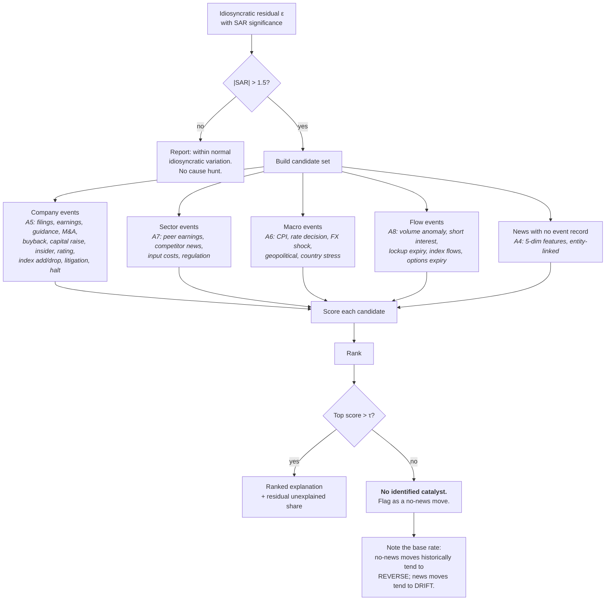
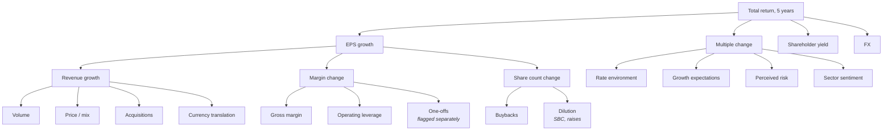
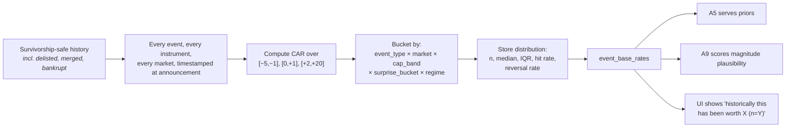

# 03 — Why did it move?

The attribution engine. This is the part of the system with the strongest evidence behind it, the lowest hallucination risk, and no equivalent in the reference framework.

---

## 1. The problem with the obvious approach

Ask a language model "why did Maybank fall 6% this month" and it will produce a fluent paragraph. The paragraph will be wrong in a specific, dangerous way: it will attribute a market-wide or sector-wide move to a company-specific cause, because that is what the training corpus rewards. Financial journalism does this every day — "stocks fell on tariff concerns" is written whether or not tariffs had anything to do with it.

The fix is mechanical, not prompt-engineering. **Split the move into its statistical components first. Only the part that survives the split needs a story.**



A system that reports "*4.7 of the 6.0 points were the market and the sector; the company-specific part was 1.3 points, and here is what happened in that window*" is telling the truth. A system that says "Maybank fell on concerns about margins" is producing text.

---

## 2. Short-window attribution: the model

### 2.1 The regression

For instrument *i* on day *t*, in the instrument's local currency:

```
r(i,t) = α(i) + β_mkt(i)·r_mkt(t)
              + β_sec(i)·r_sec(t)
              + Σ_k β_k(i)·f_k(t)
              + ε(i,t)
```

| Term | Meaning | Source |
|---|---|---|
| `r_mkt` | Local index return — KLCI for Bursa, S&P 500 for US, STI for SGX, etc. **Always the local index, never a global one** | `price_bars` |
| `r_sec` | Sector return, orthogonalised against the market so the two do not double-count | Computed nightly per market |
| `f_k` | Style factor returns: size, value, momentum, quality, low-volatility | `factor_returns`, built per market |
| `ε` | **Idiosyncratic return — the part that is about this company** | Residual |

### 2.2 Estimation discipline

Three rules, each of which is a bug if broken.

1. **Estimation window ends before the event window.** Betas come from `[t−260, t−11]` sessions. Estimating beta on a window that includes the event lets the event contaminate its own benchmark.
2. **Minimum 120 observations.** Below that, betas are noise and the whole decomposition is theatre. Newly listed instruments return `attribution_unavailable`, not a guess.
3. **Robust estimation.** Ordinary least squares is dominated by outliers, which in equity returns are exactly the days you care about. Use Huber or Theil–Sen for beta estimation.

### 2.3 Abnormal return and significance

```
AR(i,t)  = r(i,t) − r̂(i,t)                     abnormal return
CAR(i,T) = Σ AR(i,t) for t in window T          cumulative abnormal return
SAR(i,t) = AR(i,t) / σ_ε(i)                     standardised, σ from the estimation window
```

Report `SAR` alongside `AR`. A −1.3% idiosyncratic move in a stock whose daily residual σ is 0.4% is a three-sigma event worth explaining. The same −1.3% in a stock with 2.5% residual σ is Tuesday.

**Use a rank-based test alongside the parametric one.** Equity residuals are fat-tailed and skewed; a t-test on 20 observations will over-reject. The Corrado rank test is the standard non-parametric check and disagreement between the two is itself worth logging.

### 2.4 The currency layer

For a base-currency holder of a foreign asset, the return is multiplicative, not additive:

```
r_base = (1 + r_local)·(1 + r_fx) − 1
```

This is not a footnote. A Malaysian holder of a US stock can watch a position rise 8% in USD and fall in MYR. **The system reports both, always, side by side**, and the FX contribution is a first-class attribution component. Getting this wrong is the most common error in cross-border retail investing and it is entirely avoidable.

### 2.5 Attribution shares

```
share_component = contribution_component / Σ|contributions|
unexplained_share = |ε| / Σ|contributions|
```

Using absolute values in the denominator prevents the pathological case where offsetting components make a share exceed 100%. When components offset — market up, company down — the UI shows the offset explicitly rather than a misleading percentage.

---

## 3. Catalyst matching

Only the residual gets a hunt. The candidate set is built from a time-indexed event store over `[t − 2, t + 1]` sessions, widened to `[t − 5, t + 1]` for markets with slower information diffusion.



### 3.1 The scoring function

```
score = prior(event_type, market)
      × proximity(Δt)
      × specificity(entity_match)
      × direction_agreement(sign)
      × magnitude_plausibility(|SAR|)
      × source_trust
```

| Factor | Definition | Range |
|---|---|---|
| `prior` | Historical probability that this event type produces a significant move in this market and cap band — **from the system's own `event_base_rates` table**, not from intuition | 0–1 |
| `proximity` | `exp(−λ·Δt_sessions)`, λ tuned per market to reflect information-diffusion speed | 0–1 |
| `specificity` | 1.0 if the event names the instrument; 0.6 for a named direct peer; 0.3 for a sector-level item; 0.1 for a country-level item | 0.1–1 |
| `direction_agreement` | 1.0 if the event's historical mean effect has the same sign as the residual; 0.2 if opposite. **An earnings beat does not explain a fall** without an explicit "sell the news" adjustment that is itself base-rated | 0.2–1 |
| `magnitude_plausibility` | Where `|SAR|` sits in the historical CAR distribution for that event type. A routine dividend declaration cannot explain a five-sigma move | 0–1 |
| `source_trust` | Primary filing 1.0 · exchange announcement 1.0 · curated news 0.8 · general news 0.6 · web search 0.4 | 0.4–1 |

### 3.2 The honesty rules

1. **No forced explanation.** If nothing clears τ, the answer is "no identified catalyst". Empirically this is common and it is *informative*: research on news versus no-news price shocks finds systematically different subsequent behaviour — moves accompanied by identifiable news tend to drift in the same direction, while large moves with no news tend to reverse. A system that always invents a cause throws that distinction away.
2. **Multiple candidates stay multiple.** If three events score similarly, all three are shown with their scores. Collapsing to one is a false precision.
3. **The unexplained share is always displayed.** "We can account for 60% of the idiosyncratic move" is a legitimate and useful answer.
4. **Leakage is expected.** Information routinely appears in prices before the official announcement. The window therefore starts *before* the announcement date, and pre-announcement drift is reported as its own line rather than being silently folded into the event.

---

## 4. Long-horizon decomposition: "why is this up 300% over five years?"

Short-window attribution answers "what happened this week". A completely different decomposition answers the question that actually matters for a long-term holder: **was this a business improving, or a crowd changing its mind?**

### 4.1 The identity

In logs, the components are additive:

```
ln(1 + R_total) = ln(1 + g_EPS)          earnings growth
                + ln(1 + Δmultiple)       re-rating
                + ln(1 + y_shareholder)   dividends + net buybacks
                + ln(1 + r_fx)            currency, for a foreign holder
```

### 4.2 Why this matters more than any forecast

The long-run evidence is consistent: dividends and earnings growth are the dominant drivers of long-term equity returns, while valuation multiples tend to mean-revert. Multiple expansion can dominate over a decade — US equities over 2015–2024 benefited from both the highest earnings growth *and* significant multiple expansion, while Europe and Japan delivered considerably less of either — but a return that came mostly from re-rating is a return that borrowed from the future.

So the decomposition is a **risk statement**, not a curiosity:

| Pattern | Reading |
|---|---|
| Return mostly from EPS growth | The business compounded. Most durable |
| Return mostly from multiple expansion | The crowd re-rated it. Mean-reverting; the same mechanism runs in reverse |
| Return from shareholder yield | Cash returned. Durable, but check whether buybacks were funded by debt |
| Return from FX | You were paid to be foreign. Says nothing about the company |
| EPS growth strong, price flat | Multiple compressed. Often where opportunity lives — and often where value traps live |

### 4.3 One level deeper — where the earnings came from



And the quality overlay, via DuPont:

```
ROE = net margin × asset turnover × financial leverage
```

Earnings that improved through **leverage** are lower quality than earnings that improved through **margin**, which are in turn different from earnings that improved through **turnover**. Reporting which term moved is the difference between "profits doubled" and "they borrowed to buy profits".

### 4.4 The earnings-quality cross-check

Run on every workup, because it is the cheapest fraud and aggressive-accounting detector that exists:

| Check | Red flag |
|---|---|
| Net income vs cash from operations | NI rising while CFO flat or falling — the single most reliable warning sign |
| Accrual ratio `(NI − CFO) / avg assets` | Persistently high and rising |
| Receivables growth vs revenue growth | Receivables growing materially faster — revenue may not be collectible |
| Inventory growth vs revenue growth | Inventory outpacing sales — demand may be softening ahead of the numbers |
| Capitalised vs expensed costs | Rising capitalisation of development or interest costs |
| Non-recurring items | "One-off" items recurring for three or more consecutive years |
| Auditor / accounting-policy changes | Any change, in any year |
| Segment disclosure changes | Reporting segments reorganised right when one was deteriorating |

Each is a `quality_flag` on the `FundamentalsReport` and each is a candidate `thesis_breaker`.

---

## 5. The annotated chart — where this surfaces

The output the user actually sees.

```
Maybank (1155.KL) · 5-year · MYR                      [ local ▓ | MYR-base ]
   RM
 11 ┤                                            ╭──────╮
 10 ┤                              ╭─────────────╯      ╰──╮
  9 ┤              ╭───────────────╯   ▲2                  ╰────
  8 ┤    ╭─────────╯       ▲1
  7 ┤────╯   ▼3
    └────┬────────┬────────┬────────┬────────┬────────┬────────
       2021     2022     2023     2024     2025     2026

 ▲1  +7.2% in 3 sessions · idio +5.1% (SAR 3.4)
     └ Q3 result, +2 days · surprise +11% vs consensus · score 0.81
       base rate: earnings beats >10%, MY large-cap → median 3d CAR +2.9% (n=186)
       unexplained: 29%

 ▼3  −9.4% over 8 sessions · idio −1.1% (SAR 0.7, not significant)
     └ NO COMPANY CAUSE. Market −6.8%, sector −1.5%.
       Broad de-risking; regime flipped risk_off on day 2.

 5-year decomposition (MYR base):  total +58%
     EPS growth        +41%  ████████████████
     multiple change    +6%  ██
     dividends         +19%  ███████
     FX                 −8%  ▓▓▓  (MYR strengthened vs the USD earnings share)
```

Two design decisions in that mock-up carry the whole philosophy. **▼3 has no story** — the system says so, in the same visual language it uses when it does have one. And the decomposition bar tells you at a glance that this was a business compounding rather than a crowd re-rating.

---

## 6. Building the base-rate table

This is the asset that makes the whole engine credible, and no vendor sells it. It is built once and extended forever.



**Three construction rules.**

1. **The universe must include the dead.** A universe of today's listed companies has already deleted every catastrophic outcome. Build `universe_snapshot(date, instrument_id[])` forward in time, never backfilled from a current list.
2. **Bucket on what was knowable.** Surprise buckets use the consensus as it stood *before* the announcement, and cap bands use the market cap *at that time*.
3. **Report `n` everywhere.** A median CAR from six observations is presented with the six. The UI never shows a base rate without its sample size.

The pre-announcement window `[−5,−1]` is deliberate: information leaks. Measuring the pre-drift separately means you can tell a genuine surprise from a well-telegraphed one.

---

## 7. Output contract

```python
class AttributionComponent(BaseModel):
    component: Literal["market", "sector", "style", "currency", "idiosyncratic"]
    contribution: float             # in return space, local or base ccy (stated)
    share_of_total: float
    beta: float | None              # None for currency and idiosyncratic
    r_squared_contribution: float | None

class CandidateCause(BaseModel):
    cause_type: str                 # from the A5 event taxonomy
    description: str
    occurred_at: datetime
    lag_sessions: int
    score: float
    score_breakdown: dict[str, float]   # prior, proximity, specificity, direction,
                                        # magnitude, source_trust — all six, always
    base_rate: BaseRate | None          # n, median_car, iqr, hit_rate
    evidence: list[Citation]            # filing / article / announcement, never empty

class MoveExplanation(BaseModel):
    instrument_id: str
    window: tuple[date, date]
    base_currency: str
    total_return_local: float
    total_return_base: float
    components: list[AttributionComponent]
    abnormal_return: float
    standardised_ar: float
    significance: Significance          # parametric + rank test, and whether they agree
    candidates: list[CandidateCause]    # ranked, may be empty
    unexplained_share: float
    verdict: Literal[
        "explained",                    # top candidate clears τ
        "partially_explained",
        "no_identified_catalyst",       # significant idio move, nothing found
        "not_significant",              # move was within normal variation
        "market_driven",                # idio share below 20%
        "attribution_unavailable",      # insufficient history
    ]
    regime: str
    as_of: datetime
    method_version: str                 # so old explanations remain reproducible
```

`verdict` is the field the UI branches on. Five of its six values are ways of saying "there is less here than you think", and that ratio is intentional.

---

## 8. Evaluation

Attribution is one of the few LLM-adjacent capabilities that can be scored against ground truth, so it is.

| Suite | Content | Gate |
|---|---|---|
| **Undisputed causes** | ~200 historical moves where the cause is not in dispute: earnings dates, announced M&A, index rebalances, trading halts with stated reasons | Top-1 candidate correct ≥ 80% |
| **Pure beta days** | 50 days where a stock moved sharply but idiosyncratic share was under 15% | Must return `market_driven` — inventing a company cause is a hard failure |
| **No-news shocks** | 50 large idiosyncratic moves with no identifiable catalyst in any source | Must return `no_identified_catalyst` ≥ 70% |
| **Cross-market** | The same suites run separately per market | No market below 65% top-1 |
| **Decomposition arithmetic** | Long-horizon decomposition against hand-computed cases | Exact to 0.1pp |
| **Regression stability** | Bootstrap the estimation window | Beta CI width reported; unstable betas trigger `attribution_unavailable` |

The pure-beta suite is the one that matters most. Every plausible-sounding failure of this system is a variant of "told a company story about a market move", and that suite is the tripwire.

---

## 9. What this engine cannot do

Stated in the UI, not just here.

- **It cannot prove causation.** It ranks candidates by consistency with historical patterns. A high-scoring candidate is a well-supported hypothesis, not a proven cause. Interpreting an abnormal return as an event's causal effect requires that the event date is known precisely, the event was not anticipated, and no other news overlaps the window — conditions that hold cleanly in maybe half of real cases.
- **It cannot see private information.** Pre-announcement drift is measured and reported, never explained.
- **It cannot fully separate simultaneous events.** Two events in the same window get shown as two candidates, not disentangled into shares.
- **It degrades in illiquid names.** Thin trading makes betas unstable and residuals meaningless. Below a liquidity floor the engine returns `attribution_unavailable` rather than a confident-looking number.
- **Its base rates are conditional on the past regime.** Every base rate is reported with its regime breakdown; a relationship that only held in one regime says so on its face.
