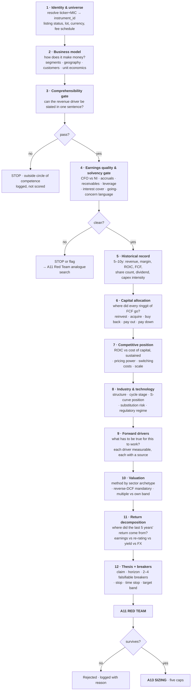
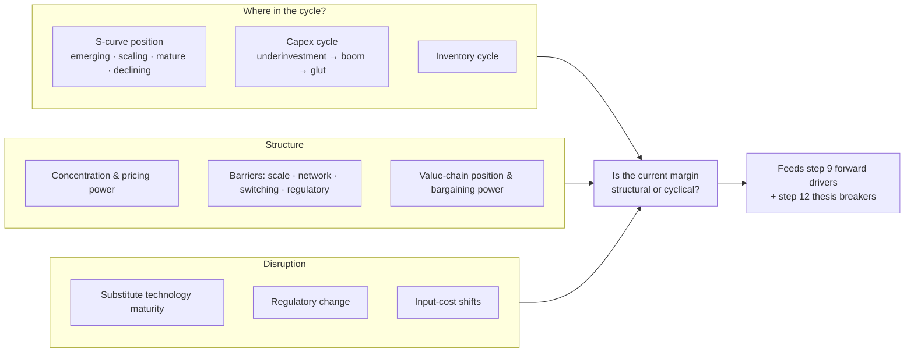

# 04 — The analyst method, codified

How a company is actually analysed, turned into an executable pipeline. Every step below is a tool call, an agent, or a gate in the system — not reading material.

---

## 1. Two disciplines, deliberately separated

The system never blends them into one score. They use different features, different targets, different decay rates and different failure modes.

| | **Investor** (6–36 months) | **Trader** (1–20 sessions) |
|---|---|---|
| Question | What is this business worth, and is the price wrong? | What is the conditional distribution of the next N days? |
| Evidence | Filings, capital allocation, competitive position, industry structure | Price, volume, liquidity, event proximity, regime, positioning |
| Target | Forward 12m excess return vs the **local** index, sector-neutralised | `P(positive N-day excess return)` — a classification problem |
| Output | Rank within a cross-section, never a price | A **calibrated** probability |
| Honest ceiling | Low single-digit annualised excess return after costs, with long stretches of underperformance. That is a *good* outcome | Hit rates of 53–56%. Anything a backtest shows above ~60% is leakage until proven otherwise |
| Dominant failure | Value trap — cheap for a reason | Costs and slippage eating a real but tiny edge |
| Kills it | Thesis breaker, time stop | ATR stop, event blackout, regime flip |

**The design consequence:** the engine's default output is **no signal**. A view has to clear a confidence gate to exist at all. Most days, for most instruments, the honest answer is that nothing has changed.

---

## 2. The workup pipeline

Twelve steps. Steps 1–4 are disqualifiers — a company that fails them never reaches valuation, which saves both money and self-deception.



### Why the gates come first

Steps 3 and 4 kill most candidates, cheaply. A company whose revenue driver cannot be stated in one sentence cannot have a checkable thesis, and a company whose net income is drifting away from its operating cash flow does not need a valuation — it needs a red-team analogue search. Running a full DCF on a business with deteriorating earnings quality is how sophisticated-looking analysis produces confident losses.

---

## 3. Step 5 in detail — reading the history

The user's phrasing was "looking in their past history, company portfolio, earning, financial planning". That maps to four distinct passes over the filings, run by A1.

### 3.1 The ten-year series

Every one of these becomes a time series in `fundamental_facts`, each row `known_at`-stamped:

| Series | What you are looking for |
|---|---|
| Revenue, by segment and geography | Which part actually grew, and whether the mix shifted toward or away from the profitable part |
| Gross margin | Pricing power or its absence. Stability matters more than level |
| Operating margin | Operating leverage — does margin expand as revenue grows, or does cost grow with it? |
| Net income vs cash from operations | The divergence check. Run every year, not once |
| Free cash flow = CFO − maintenance capex | The number that actually belongs to owners |
| ROIC | The clearest single signal of a moat. Sustained above ~15% for five or more years is the strongest quantitative evidence that a competitive advantage exists |
| Capex / revenue, and capex vs depreciation | Whether growth is being bought and how expensively |
| Share count | Dilution is a silent return killer; buybacks are only good if bought cheap |
| Net debt / EBITDA, interest cover | Survivability. Below 4× and above 3× respectively are common working thresholds |
| Working capital cycle | Cash conversion, and an early warning on demand |
| Dividend and payout ratio | Sustainability, and what management believes about reinvestment opportunities |

### 3.2 The "company portfolio" pass

What the company *owns and operates*, and how each part performs:

- **Segment P&L** — most groups have one good business subsidising two bad ones. Consolidated numbers hide this by construction.
- **Subsidiaries and associates** — equity-accounted income is not cash. Track it separately.
- **Asset base** — property, concessions, licences, brands, capitalised R&D. Which are productive and which are legacy.
- **Related-party transactions** — a disclosure that is boring in 95% of cases and decisive in the other 5%.
- **Off-balance-sheet** — leases, guarantees, joint-venture debt, contingent liabilities.

### 3.3 The capital-allocation pass (step 6)

Sum ten years of free cash flow and account for every unit of it. This single exercise tells you more about management than any interview:

```
Cumulative FCF (10y)
  → reinvested in the business      at what incremental ROIC?
  → acquisitions                    at what price, and did they earn back the cost of capital?
  → buybacks                        at what average price vs the range since?
  → dividends                       covered by FCF, or by debt?
  → debt reduction
  → cash accumulation               idle cash is a decision too
```

The pattern to reward: reinvestment at high incremental ROIC, buybacks only when cheap, no empire-building acquisitions. The pattern to distrust: acquisitions timed to the top of the cycle, buybacks concentrated at the highs, dividends maintained through debt.

### 3.4 The "financial planning" pass

What the company has *told you* it intends to do, and whether it did it:

- Guidance history vs actual, three years back. A management team that consistently guides low and beats behaves differently from one that consistently misses.
- Stated capital-allocation policy vs the actual cash-flow statement.
- Announced buyback programmes vs shares actually repurchased — A8's `buyback_execution_rate`. Announcing is free; executing is not.
- Capex plans vs capex spent.
- Language drift in guidance across quarters — A10's `guidance_language_delta` over `kb_transcripts`, which reads the Q&A separately from the prepared remarks because the two behave differently.

---

## 4. Valuation method selection (step 10)

Wrong method, confident number, wrong answer. A2 selects by sector archetype and refuses methods that do not apply.

| Archetype | Primary | Secondary | Never | Why |
|---|---|---|---|---|
| Banks, insurers | P/B vs ROE, dividend discount | P/E vs history | DCF | Debt is raw material, not financing; FCF is not meaningful |
| REITs, property | FFO/AFFO yield, NAV | Cap-rate spread vs bonds | EPS multiples | Depreciation is an accounting artefact here |
| Utilities, concessions | Regulated asset base, DCF on a contracted life | Dividend yield vs bond | Revenue multiples | Cash flows are contractual — DCF is genuinely appropriate |
| Cyclicals (commodity, shipping, semis) | Mid-cycle earnings power, EV/replacement cost | P/B at cycle trough | Trailing P/E | Peak earnings on a low multiple is the classic cyclical trap |
| Software, subscription | EV/gross profit, rule-of-40, cohort economics | Reverse-DCF | Trailing P/E while reinvesting | GAAP earnings are suppressed by growth spend |
| Consumer staples | DCF, EV/EBIT vs history | Yield | — | Stable enough for DCF to be honest |
| Early-stage, pre-profit | **Reverse-DCF only** | Scenario tree | Any forward multiple | State what the price implies; do not manufacture a value |
| Holding companies | Sum-of-parts with a stated discount | NAV | Consolidated multiples | Consolidated numbers are meaningless |

### 4.1 Reverse-DCF is mandatory

For every candidate, regardless of archetype, A2 runs the reverse: **what growth and margin does the current price already require?** Then asks whether those requirements are plausible given the ten-year history from step 5.

This inverts the usual failure. A forward DCF invites you to build assumptions that justify a conclusion you already reached. A reverse-DCF hands you the market's assumptions and asks you to disagree with something specific. It is also the only valuation output that is genuinely honest about pre-profit companies.

### 4.2 Multiples require three contexts

A P/E of 14 means nothing alone. A2 always reports it against:
1. **Its own history** — the 5- and 10-year band, with the percentile.
2. **Its sector peers in the same market** — cross-border multiple comparison without normalising for accounting regime, tax, capital structure and index composition is noise.
3. **What the multiple implies** — the reverse-DCF from §4.1.

---

## 5. Step 8 — the industry and technology lens

The user's "new technologies" requirement. Owned by A7, and the question it exists to answer is: **did this company do something, or did its industry change underneath it?**



**The discipline that keeps this from becoming futurism.** Every technology claim must resolve to something observable in the near term: a capex line, a segment disclosure, a patent or standards filing, a named customer contract, a regulatory decision with a date. "AI will transform this sector" is not an input. "Segment capex rose 3× and management guided to a named contract starting Q3" is.

Supply-chain and substitution reasoning runs on the Neo4j graph, and **every multi-hop claim carries its traversal path with a per-hop decay weight**. A three-hop inference renders visibly weaker than a direct link, because it is.

---

## 6. The trader's layer

Everything above is the investor discipline. The trader's layer is thinner, faster-decaying, and honest about it.

### 6.1 What the evidence supports

| Effect | Standing | Caveat |
|---|---|---|
| **Cross-sectional momentum** | Accepted as a standard equity risk factor alongside market, value and size | Concentrated in the first months after a trend forms; crowded |
| **Time-series momentum / trend following** | Positive and significant across asset classes over very long samples, including a 12-month lookback with 1-month holding, and positive across ten-year sub-periods back to the 19th century | **The strength of fast trend following has declined materially over time**, and some recent work finds the evidence weak across large cross-sections |
| **Post-earnings announcement drift** | A durable, widely documented anomaly — prices continue in the direction of the earnings surprise | Magnitude relates to surprise size and investor attention; costs eat much of it in small caps |
| **News vs no-news moves** | Moves with identifiable news tend to drift; large moves with no news tend to reverse | This is why A9's `no_identified_catalyst` verdict is a feature |
| **Most chart patterns** | No reliable evidence at retail time horizons | Which is why A3 attaches a **measured base rate with its sample size** to every pattern, and marks patterns without one `unvalidated` |

### 6.2 Structural rules, enforced in code

1. **Earnings blackout.** Short-horizon signals are suppressed within 3 sessions of a scheduled earnings date. Event risk dominates every technical feature; without this rule the model learns a spurious pattern that is really just "sometimes earnings are good".
2. **Liquidity floor.** No short-horizon view on an instrument below a minimum 20-day average daily value. The edge is smaller than the spread.
3. **Cost floor before signal.** Round-trip cost — commission, half-spread, stamp duty, clearing, FX conversion — is computed *first*. If the expected edge does not clear it by a margin, there is no signal to discuss.
4. **Calibration or nothing.** A short-horizon probability that has not passed isotonic or Platt calibration on a held-out window is not surfaced. An uncalibrated 0.72 is not a number, it is a mood.

### 6.3 Cost model, applied to every simulated and paper fill

```
round_trip_cost = commission_buy + commission_sell
                + half_spread × 2
                + participation_slippage(size / ADV)
                + stamp_duty
                + clearing_fee
                + fx_conversion_spread × 2      (cross-border only)
                + dividend_withholding           (holding period, cross-border)
```

For Bursa specifically, the mandatory legs in 2026 are a clearing fee of 0.03% (capped RM 1,000) and stamp duty of RM 1 per RM 1,000 — 0.1%, capped at RM 1,000 — each applied to both buyer and seller, with brokerage typically 0.1% subject to a minimum. Those minimums are what make small positions uneconomic, which is exactly what the cost-floor cap in §4.2 of `05-RISK-AND-GUARDRAILS.md` exists to catch.

---

## 7. The thesis memo — the output of the whole pipeline

Produced by A10, attacked by A11, stored with the position, and re-checked automatically forever.

```yaml
instrument: 1155.KL
as_of: 2026-08-24
horizon: long            # 6-36 months
claim: >
  One sentence. What has to be true, and why the price does not reflect it.

drivers:
  - name: Net interest margin recovery
    evidence: [filing:Q2-2026#note14, transcript:Q2-2026#CFO-turn-18]
    sign: positive
    weight: 0.4
    measurable_as: "NIM series, quarterly, from segment disclosure"
  - name: Credit cost normalisation
    evidence: [filing:Q2-2026#note9]
    sign: positive
    weight: 0.35

valuation_anchor:
  method: P/B vs ROE
  current: 1.12
  own_10y_band: [0.94, 1.61]
  percentile: 22
  reverse_dcf_implies: "ROE of 8.9% in perpetuity vs 10-year average of 10.4%"

return_decomposition_5y:      # from A9 §4
  total: +0.58
  eps_growth: +0.41
  multiple_change: +0.06
  shareholder_yield: +0.19
  fx: -0.08
  reading: "Business compounded; almost no re-rating. Durable shape."

breakers:                      # each MUST map to an executable query
  - condition: "ROE below 8% for two consecutive quarters"
    check: "SELECT roe FROM fundamental_facts WHERE ... ORDER BY period_end DESC LIMIT 2"
    source: fundamental_facts
  - condition: "Gross impaired loans ratio above 2.5%"
    check: "..."
  - condition: "Net interest margin below 2.0% for two consecutive quarters"
    check: "..."

risk_stop:   {type: atr, multiple: 2.5, window: 20}
time_stop:   2028-08-24
target_band: {upper_pb: 1.45, action_on_reach: trim}

red_team:
  verdict: weakened
  attacks:
    - claim: "NIM recovery assumes no further policy rate cuts"
      evidence: [macro:BNM-calendar, news:2026-07-11#id]
      severity: medium
  analogues:
    - case: "Regional bank, 2015-2018"
      pattern: "NIM thesis defeated by a rate cycle turn"
      outcome: "flat for 3 years, thesis correct but early"

confidence: 0.61
band: accumulate
disclaimer: "Candidacy statement. Not advice. Not a recommendation to transact."
```

**The breakers are the point of the whole document.** Written before entry, stored with the position, checked on every fundamentals update and every relevant news event. They convert "I still like it" — which is a feeling — into "condition three has been true for two quarters" — which is a fact that fires an exit.

---

## 8. What to be honest about, in the UI and not just here

- **Point price forecasts are not achievable.** Anyone producing them is fitting noise. This system forecasts distributions and relative rank.
- **Most of the value is not prediction.** It is position sizing, risk control, cost discipline, and not selling at the bottom. The sizing engine will contribute more to the outcome than the alpha engine.
- **The realistic long-horizon prize** is a low single-digit annualised excess return over the local index, after costs, with multi-year stretches of underperformance.
- **Alpha decays.** It is a documented phenomenon with its own literature, not folklore. Any edge that is found will erode as it is used and as others find it. The eval ratchet and the calibration kill switch are the structural response.
- **Trading more is not trading better.** Overconfidence expresses itself as turnover, and the least active traders in the classic study outperformed the most active by a wide margin. Turnover caps are therefore a *feature*, not a limitation.
