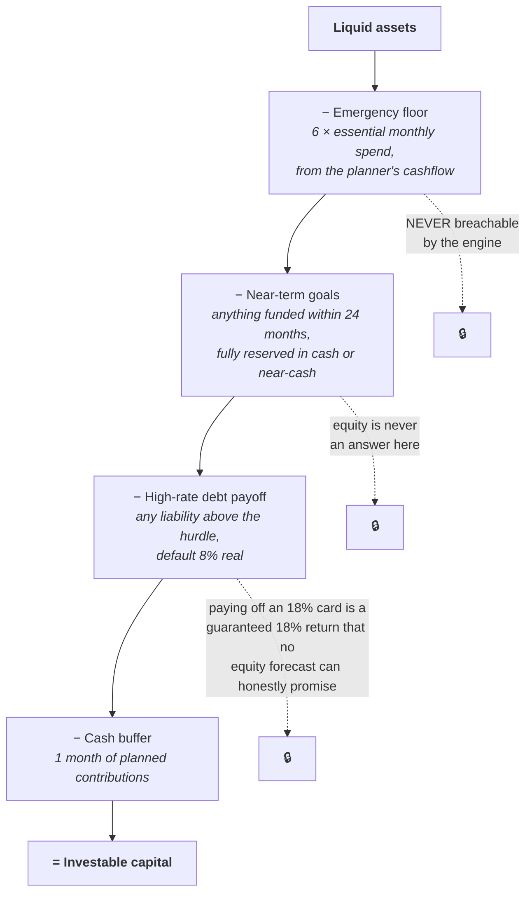
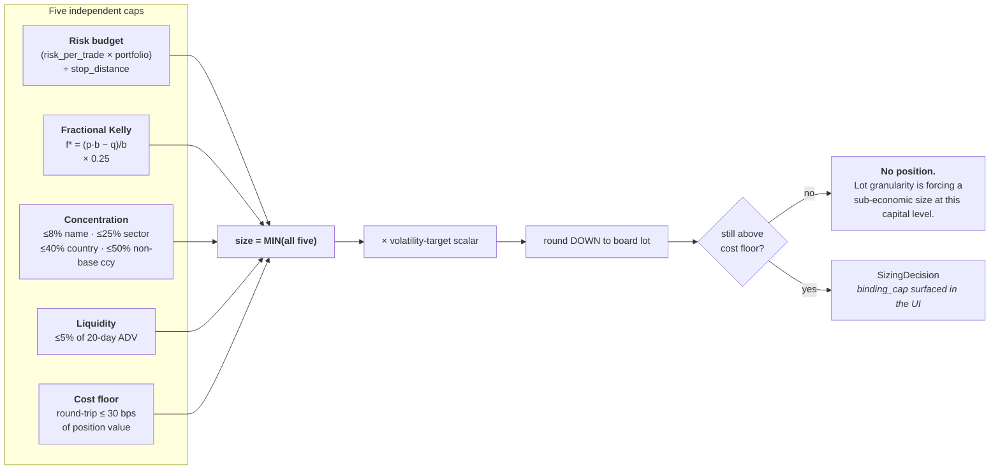
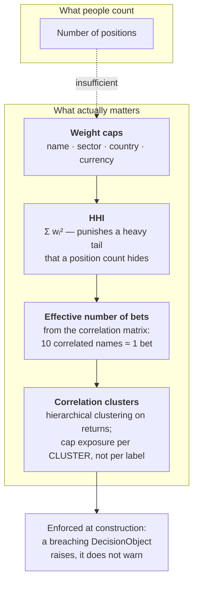
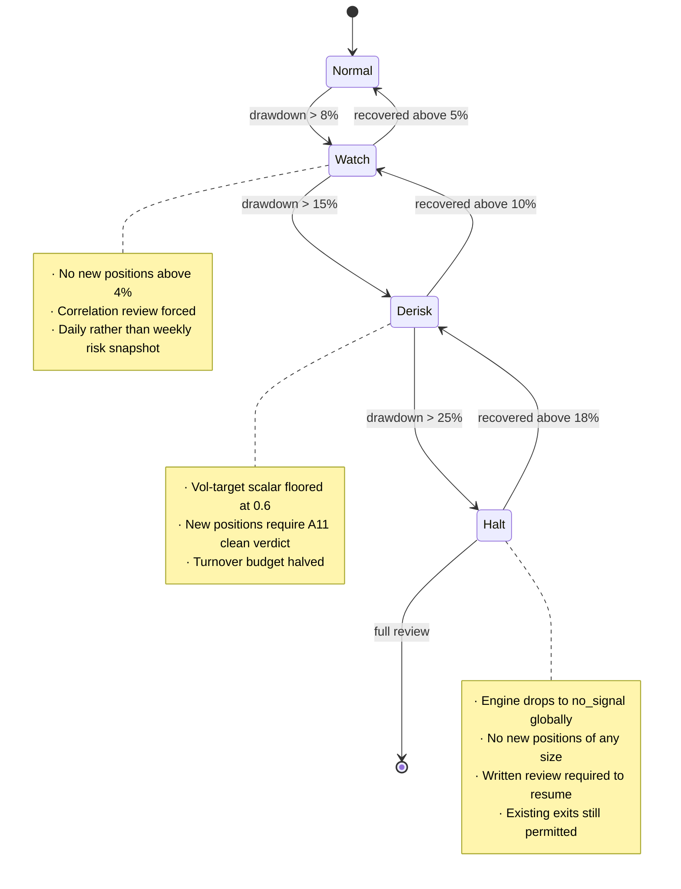
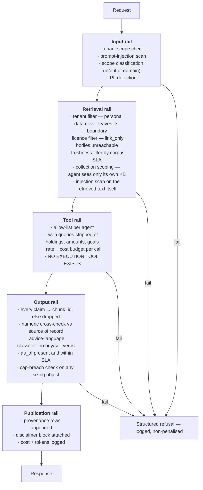

# 05 — Risk management and guardrails

Two different things, both required.

- **Risk management** is about the money: how much goes into one name, how the portfolio behaves when several positions are wrong at once, and what happens during a drawdown.
- **Guardrails** are about the system: what the agents are structurally incapable of doing, regardless of what the model generates or what a prompt asks for.

The distinction matters because guardrails written as prompt instructions are suggestions. Everything in §2–§6 below is enforced in code, in the type system, or in a database constraint. A `SizingDecision` that breaches a cap **cannot be constructed** — the constructor raises.

---

## 1. The governing idea

> Most of the value is not prediction. It is position sizing, risk control, cost discipline, and not selling at the bottom.

The sizing engine will contribute more to the outcome than the alpha engine, because the alpha engine's honest ceiling is a low single-digit annualised excess return with long stretches of underperformance, while a sizing error can remove a third of the capital in one position. Asymmetry of that shape means risk control is not the safety rail on the side of the project — it *is* the project.

---

## 2. Layer 1 — Investable capital waterfall

Before any question about which stock, there is a question about how much money is allowed to be in stocks at all.



Three hard rules:

1. **The emergency floor is never breachable.** Not for a high-conviction idea, not for a temporary dip, not ever. There is no override flag in the API.
2. **Near-term goals hold cash or near-cash**, regardless of how good a signal looks. A goal funded in 18 months has no time to recover from a drawdown.
3. **Debt above the hurdle always outranks equity.** This is arithmetic, not preference.

Monthly recurring inflow is the planner's computed savings rate, deployed on a schedule rather than accumulated as idle cash waiting for a better moment. Waiting for a better moment is a forecast, and forecasts are the weakest part of the system.

---

## 3. Layer 2 — Per-position sizing: the minimum of five caps



### 3.1 What each cap is protecting against

| Cap | Protects against | Note |
|---|---|---|
| Risk budget | A single position doing serious damage | Bounds the **loss**, not the position. Stop distance in ATR multiples, not a round percentage — wide enough to survive normal noise *for that instrument* |
| Fractional Kelly | Over-betting on an estimated edge | Kelly is optimal only with *true* probabilities. Yours are estimates, so quarter-Kelly. Half-Kelly cuts volatility roughly in half while giving up about a quarter of expected growth — an exceptionally favourable trade when inputs are uncertain. Full Kelly is a theoretical ceiling, not a target |
| Concentration | Being wrong about one thing | §4 |
| Liquidity | Not being able to exit in a bad week | 5% of 20-day ADV. In a stressed market, ADV falls exactly when you need it |
| Cost floor | Donating to brokers | Below this the round trip consumes the edge |

### 3.2 The Kelly gate

**Kelly stays disabled until 50–100 logged outcomes exist.** Until then the sizing engine runs on the risk-budget, concentration, liquidity and cost caps only. This is an explicit gate in code, not a guideline — with fewer than ~50 resolved decisions, the win rate and payoff ratio Kelly consumes are indistinguishable from noise, and a noisy Kelly is worse than no Kelly because it is confidently wrong in both directions.

Two further rules:
- **Recalculate Kelly inputs quarterly.** Edges change; sizing must change with them.
- **Sanity ceiling.** A computed edge above ~30% means the model is broken, not that something was found. The engine refuses to size on implausible edges and raises an alert.

### 3.3 Volatility targeting

A portfolio-level overlay above the per-position caps: scale gross exposure so realised portfolio volatility stays near a target. The mechanism automatically shrinks exposure when volatility rises — which is precisely when losses cluster — and expands it when conditions calm. It is one of the few risk controls that acts *before* the loss rather than after it.

```
scalar = clamp(target_vol / realised_vol_60d, 0.5, 1.0)
```

Capped at 1.0 deliberately: the overlay may de-risk, never lever up.

### 3.4 Worked example

Investable capital RM 20,000 after the waterfall. Candidate at RM 6.20, ATR₂₀ = RM 0.31, stop at 2.5 × ATR = RM 0.775 (12.5% of price).

| Cap | Computation | Value |
|---|---|---|
| Risk budget | 0.75% of 20,000 = RM 150 risk ÷ 12.5% | **RM 1,200** |
| Quarter-Kelly | p = 0.56, b = 1.8 → f* = 0.316 → ×0.25 = 7.9% | RM 1,580 |
| Concentration | 8% of 20,000 | RM 1,600 |
| Liquidity | 5% of 20-day ADV | RM 40,000+ |
| Cost floor | minimum viable at 30 bps | ≈ RM 900 |

Minimum = **RM 1,200** → 193 shares → board-lot rounding gives **1 lot (100 shares) = RM 620**.

The engine flags that lot granularity is forcing a sub-optimal size at this capital level, and states the implication plainly: **at small capital, fewer positions sized properly beats many positions sized by rounding error.** That flag is more useful than the number.

---

## 3.5 Corrections found by building it

Implementing §3 surfaced places where the written plan contradicted itself or
the market. All are now encoded in code with tests, and each is listed with the
file that enforces the correction.

**The 30 bps cost floor is unreachable on Bursa.** A round trip there is
2 × (0.1% brokerage + 0.03% clearing + 0.1% stamp) ≈ **46 bps** before the RM 8
brokerage minimum, and only falls under 30 bps above roughly RM 4m of
consideration once the RM 1,000 caps bind. A single global floor would refuse
every Bursa position ever taken. The floor is therefore **per-market**, set near
1.3× each market's asymptotic cost: 60 bps for XKLS, 5 bps for XNAS.
Those are VENUE floors. Where an account's own costs differ, the floor is the
broker's: a `moomoo_my` account pays 6 bps of commission alone, so the 5 bps
XNAS figure is not a starting point to nudge — it is unreachable at any size,
and `markets/brokers.py` carries the 20 bps that account actually clears.

The useful number that falls out: **the minimum economic Bursa position is about
RM 4,700.** Below that the RM 8 minimum dominates and the round trip eats more
than the floor allows. A single lot at RM 6.20 costs 284 bps to trade — nine times
the floor. This is the "donation to brokers" in §3.1, computed rather than asserted.

**The worked example in §3.4 trips the sanity ceiling in `09 §8`.** Its arithmetic
is right — p = 0.56, b = 1.8 gives f\* = 0.316 and quarter-Kelly 7.9% — but 31.6%
clears the rule that a claimed 30% edge means the model is broken. The ceiling
wins: a 56% hit rate at 1.8:1 is an extraordinary strategy, not an illustration,
and `04 §1` puts the honest short-horizon ceiling at 53–56%. Realistic inputs
(p = 0.54, b = 1.5) give f\* = 0.233 and pass.

**A third correction, from building the cost model.** The cost floor above is
computed from the *fee schedule* only. Market impact is not in it, and at
realistic size it dominates: square-root impact means a fill at 5% of 20-day ADV —
the liquidity cap itself — costs roughly **224 bps of impact** against 23 bps of
Bursa fees. Ten times the size is 3.2× the *rate* and 32× the total cost.

Two consequences. The liquidity cap is not only about being able to exit; staying
well inside it is what keeps impact from eating the edge. And the cost floor as
specified is a **lower bound on cost, not an estimate of it** — the backtest
harness applies the full model (fees + half-spread + participation slippage + FX
leg + withholding), and that is the number any signal must clear.

**And one calibration note on §4.** Clearing 5 effective bets needs roughly ten
names at 0.10 correlation or better. Six names at 0.15 correlation gives 3.4.
The bar measures independence, not headcount, and it is demanding on purpose.

### 3.5.1 Seven more, from building the agent layer and the first T2 market

**A rejected catalyst was rendering as the cause.** `ui/render.py` branched on
whether the candidate list was empty rather than on the verdict. A story that
scored 0.11 — below the 0.25 threshold, explicitly rejected — appeared under the
move as though it explained it. This is precisely the failure the whole
attribution design exists to prevent, reintroduced at the last inch by the
presentation layer. The renderer now branches on `Verdict` first and labels
rejected candidates `BELOW THRESHOLD`. **Lesson: an output rail is not enforced
until the renderer enforces it too.**

**The no-execution guard allowlisted by basename.** `tests/test_no_execution_anywhere.py`
exempted `policy.py` — meaning any *new* file called `policy.py`, anywhere in the
tree, would have inherited the exemption. Now exact paths, plus a second test that
fails when an exemption is no longer needed. That rot check immediately earned
itself: it caught a stale entry for `agents/registry.yaml` within a minute of
being written.

**Routing matched "fell" but not "fall".** `why did maybank fall today` fell
through the intent table to the concept-explainer. A one-word gap in a regex
routed a price-move question to a teacher. **Lesson: intent classification needs
negative-case evals, not just happy-path ones — which is now what the ratchet in
`core/registry/loader.py` requires before anything can register.**

**Six agent ids drifted from the registry — and nothing crashed.** The classes
said `a5_events`; the registry said `a5_catalyst_events`. No exception, no failed
test, no log line. What actually happened: `A10Thesis.REQUIRED_EVIDENCE` names the
registry ids, so two agents that *were* reporting were counted as missing. Every
thesis therefore carried two phantom evidence gaps, docked its own confidence by
0.24 (0.75 → 0.51) **on every run, forever**, and the red team raised a `coverage`
challenge every single time — a challenge that always fires carries exactly as
much information as one that never fires.

**This is the defining failure mode of a system whose job is to express
uncertainty: a bug does not look like a crash, it looks like a slightly-too-humble
answer, permanently.** A system that is wrong in the confident direction gets
caught within a day. One that is wrong in the modest direction can run for years,
and every one of its outputs is subtly, invisibly degraded.

**The registry was decorative, which is how the drift survived.** The tool
allowlist was a separate hand-maintained dict that happened to be correct, so the
registry's own tool names were never exercised. They had drifted too: the registry
called A3's tools `trend_state` and `volatility` while the code guarded `ohlcv`
and `atr`. Building the allowlist from the registry — the entire purpose of a
capability registry — made A3 deny its own first call. Both are fixed by
`Registry.allowlist()` plus two tests that fail if any class drifts from the
registry on either identity or tools. **The lesson is not "check your strings": it
is that a registry nothing reads is a comment, and comments rot.**

**A market with no explicit cost floor inherits the default by accident.**
Onboarding XSES showed the gap: it fell through to `COST_FLOOR_BPS_DEFAULT`
without anyone deciding that was right. It happens to be right — Singapore's
asymptote is ~24 bps, so 30 is reachable — but that was luck, and the next market
added would have inherited the same silence. XSES now has an explicit 30 bps
entry *because* it agrees with the default, and a test fails if any supported
market lacks one.

**The `should_i_buy` floor leaves only 2× headroom.** The plan's minimum honest
plan for a buy question (fundamentals + valuation + thesis + red team) costs
RM 1.48 against RM 2.95 for the full twelve-agent version. Trimming to fit a
budget therefore has very little room before it must refuse instead. That is the
intended behaviour — `01 §4.3` says a cheap wrong answer is worse than a refusal —
but it means **budget-constrained routing will refuse more often than it trims**,
and the UI should say so rather than implying a cheaper answer exists.

### 3.5.2 Four more, from stress testing

`stress/run.py` exists to break the system rather than confirm it: volume it was
not sized for, numbers that are not numbers, inputs sitting exactly on a
threshold, eight concurrent writers, and text trying to talk to the model. It
runs in CI and exits with the finding count. First run: **six findings, four of
them real defects, all in the same family.**

**A non-finite return reached a verdict.** `decompose` with a NaN return produced
`no_identified_catalyst` with `unexplained_share = nan` — which renders to a user
as a confident finding with "nan% unexplained". This is precisely the failure the
whole attribution design exists to prevent, arriving through the *data* rather
than through the model. Non-finite inputs now return `attribution_unavailable`
naming the offending field.

**A cap could go negative and therefore always win.** `liquidity_cap` passed a
negative ADV straight through. A negative cap is the smallest of the five, so it
wins `CapSet.binding()` every time and carries a negative target size downstream —
**a cap that inverts the thing it is meant to bound.** Refused at the source now.

**HHI could exceed its own range.** Weights of `[-0.5, 1.5]` returned 2.5. HHI is
bounded [0, 1] and compared against a 0.18 limit, so 2.5 does not read as bad
data; it reads as extreme concentration. Negative and non-finite weights are
refused.

**The diversification number could be impossible.** A correlation of 2.0 gave
**0.67 effective bets from two positions**, when the range is [1, n]. The matrix
is now validated — off-diagonal within [-1, 1], unit diagonal, square — and the
result clamped to [1, n] against floating-point error on a near-singular matrix.

**What the four have in common** is the theme of §3.5.1 restated in a different
register: none of them crashed. Each produced a number that looked like an
answer. Three of the four would have shown a *more alarming* reading than the
truth, and the fourth a nonsense one — and a system whose outputs are numbers a
human acts on cannot tell the difference between a bad number and a bad input
unless it checks at the boundary.

**What held.** 500-name concentration checks in 34 ms, 26 years of bars, a
400-node graph, eight concurrent writers landing 200/200 rows, every cap binding
exactly at its threshold, 2,000 randomised decompositions keeping the unexplained
share inside [0, 1], and seven hostile documents — prompt injection, null bytes,
a 200k-character body, SQL and path traversal — ingested without one linking
itself to a traded instrument.

### 3.5.3 The unit of account: four defects behind one missing word

Adding ten foreign markets to a repository built for Bursa introduced eight
currencies and no way to tell them apart. The book is MYR — that was never in
doubt and `BASE_CURRENCY = "MYR"` had been in `core/contracts/money.py` from the
start. What was missing is that **no number outside `Money` carried its
currency**, so nothing could notice when two of them met.

Four places where they met, none of which raised, all of which returned a
finite, plausible, correctly-typed number:

**`CapSet.binding()` took a `min()` across two currencies.** `risk`, `kelly` and
`concentration` derive from the portfolio and are MYR. `liquidity` derives from
local turnover and `cost_floor` from a local fee schedule — both in the market's
own currency. `min()` compared them as bare numbers and returned whichever was
numerically smaller regardless of unit. A thinly-traded US name with USD 300k of
daily value gives a USD 15,000 liquidity cap; against an MYR 40,000 concentration
cap `min` picks 15,000, and the system deploys **MYR 63,000 against a limit that
had just computed 40,000** — a 58% overshoot, reported as compliant.

**`size()` divided an MYR cap by a native price.** `units = value / price`, with
nothing naming either side. On a USD 180 stock an MYR 40,000 cap bought 222
shares — USD 39,960, or **MYR 167,832 of a MYR 500,000 book: a 33.6% position
from an 8% limit**, labelled `bound by concentration`. The same arithmetic on a
JPY name buys a thirty-eighth of the intended size, so the error is not even
consistently in one direction; it is consistently the exchange rate.

**The prospective concentration check was fed the same wrong number.**
`new_weight = final_value / port_value` put a native numerator over an MYR
denominator, so the last line of defence — the check that runs on the portfolio
*after* the trade — saw a weight off by the same factor and passed the breach.

**`currency` was copied from the `country` field.** In `ask.py` and in the MCP
tool, a position typed with country `MY` carried currency `"MY"`, which is not
`"MYR"`; `check()` counts anything that is not the base currency as foreign
exposure, so **a book of nothing but Bursa stocks reported 100% foreign-currency
exposure and breached the 50% limit.** A false refusal, produced by a field
nobody was reading, in the same line that produced a false pass for anything
genuinely foreign.

**The fix is a declared boundary, not a conversion.** `CapSet` now names the one
currency all five of its caps are in. The market's currency is read off its
adapter (`markets.registry.market_currency`) rather than passed in, because a
caller who can pass it can pass it wrong. Sizing happens entirely in the
market's currency — that is where lots, ticks and fee minimums are meaningful —
and the portfolio converts *into* it once, on the way in; only the result
crosses back to MYR, once, on the way out. Crossing without an explicit dated
rate raises `CurrencyMismatch` rather than assuming 1.0. Every figure a user
sees is labelled, and a foreign one is shown alongside its MYR equivalent:
`USD 9,523.81 = MYR 40,000.00`.

**What makes this the same failure as MYX/XKLS drift** (§3.5.1) is that the
wrong answer was reachable only because two producers of a number disagreed
about what the number meant, and nothing in the type system could hold an
opinion. The floor drift cost a factor of two; the currency drift costs the
exchange rate, which for JPY is a factor of 78.

`stress/run.py` now sizes an 8% slice of a MYR 500,000 book on **every**
registered market and checks the result back in MYR. Ten of eleven land on
RM 40,000 exactly; London refuses, because at RM 40,000 an LSE round trip is
75 bps against a 75 bps floor — stamp duty makes an 8% slice of this book
marginally sub-economic there. That is a true fact about the market, surfaced
by the probe rather than asserted by it.

---

---

## 4. Layer 3 — "Don't put all the eggs in one basket", made mechanical

The instinct is right and the naive implementation is wrong. Holding twenty stocks is not diversification if they are twenty banks in one country. The system therefore measures concentration four ways and enforces all four.

### 4.1 The four measures



### 4.2 The limit table

| Limit | Default | Rationale |
|---|---|---|
| Single name | ≤ 8% | Survives being completely wrong about one company |
| Sector | ≤ 25% | Sector shocks are common and correlated |
| Country | ≤ 40% | Country risk is real and includes currency, policy and rule-of-law risk |
| Non-base currency | ≤ 50% | Currency is a position whether or not you intended one |
| **Correlation cluster** | ≤ 30% | The cap that catches "twenty banks" — clusters are derived from returns, not from sector labels |
| HHI | ≤ 0.18 | Roughly equivalent to no fewer than ~6 genuinely equal-weight bets |
| **Effective number of bets** | ≥ 5 | The honest diversification count |
| Minimum positions | ≥ 5 when investable capital allows economic sizing | Below this, single-name risk dominates everything else |
| Portfolio heat | ≤ 6% | Total open risk (sum of per-position risk to stop). Professional practice commonly caps total risk in the 4–8% range |
| Single-day liquidation | ≤ 20% of portfolio at 20% of ADV | Can you get out in a week? |

**Defaults are per-user configurable within bounds.** The bounds themselves are not: single name cannot be raised above 15%, effective bets cannot be set below 3, and the emergency floor cannot be disabled. A configuration file that tries is rejected at load with an error naming the violation.

### 4.3 Why correlation clusters, not sector labels

Sector classification is a taxonomy someone else chose. Correlation is what your money actually experiences. A palm-oil producer, a fertiliser distributor and a shipping company sit in three different sectors and one commodity cycle. Hierarchical clustering on 2-year daily returns finds that grouping without being told about it.

The cluster map is recomputed nightly and shown in the UI as a treemap. It is routinely the single most surprising screen in the system for anyone who thought they were diversified.

---

## 5. Layer 4 — Drawdown governance

Drawdown is the risk that is actually experienced, and the one that causes the behavioural failure that does the real damage. Conservative portfolios typically see maximum drawdowns in the 10–15% range, moderate 15–25%, aggressive 25–40% or more — so the first job is to state which one this portfolio is, and the second is to have decided in advance what happens at each level.



Two properties make this work. **The tiers are pre-committed** — decided in calm conditions, written into config, not negotiated during the drawdown. And **exits are always permitted** in every state: the system never traps a position by refusing to act.

Report the **longest underwater period** alongside maximum drawdown. It is the number people actually have to live through, and a strategy with a 20% max drawdown that recovers in four months is a completely different experience from one with the same drawdown that takes three years.

---

## 6. Layer 5 — Behavioural guardrails

The measurable biases are well documented and each has a mechanical countermeasure. This layer exists because the system's user is a person, and the person is a component of the system.

| Bias | Evidence | Countermeasure in the system |
|---|---|---|
| **Disposition effect** — selling winners, holding losers | Consistently documented across markets | Exit rules are written *before* entry and checked automatically. The system surfaces "this position is being held past its time stop" as an alert |
| **Overconfidence → overtrading** | The least-active traders in the classic study returned 18.5% annually versus 11.4% for the most active | Hard turnover cap; no-trade buffer requiring the target-vs-actual gap to exceed round-trip cost × 3; the trade count is displayed as a *cost*, not an activity metric |
| **Loss aversion** — a loss hurts about twice as much as an equivalent gain | Kahneman & Tversky, replicated extensively | Position sizing is set so a normal loss is survivable *before* it happens; the calibration panel reframes outcomes as distributions rather than verdicts |
| **Recency and salience** | Well established | Base rates shown next to every claim, with `n`. Reflections retrieved by relevance, never bulk-injected into prompts, which would bias toward whatever happened last |
| **Confirmation bias** | Well established | A11 is a structurally separate agent with a retrieval configuration that *excludes* the supporting evidence |
| **Hindsight bias** | Well established | The decision journal stores the reasoning *as it was written at the time*, immutably. You cannot retroactively have known |

Two process controls sit on top:

- **Cooling-off period.** A new `accumulate` band on a name not previously in the candidate set cannot be acted on for 24 hours. Nothing in a 6–36-month thesis is urgent, and the feeling that it is urgent is itself a signal.
- **Pre-mortem, required at entry.** Before the first tranche, the user records one sentence: *"If this fails, the most likely reason will be ___."* It goes into the journal. A14 checks it against the actual outcome at close. This is the cheapest calibration exercise that exists.

---

## 7. Kill switches

Automatic, global, and not overridable from inside a session.

| Trigger | Action |
|---|---|
| Rolling 6-month Brier score degrades past threshold | Engine drops to `no_signal` globally and alerts. Silent degradation is the standard failure mode of a forecasting system |
| Attribution accuracy on the pure-beta suite falls below 90% | A9 output is suppressed; explanations become components-only, no candidate causes |
| Any data feed stale beyond 3× its SLA | Dependent agents refuse rather than serve stale facts |
| Citation validity below 98% on nightly eval | Generation blocked; retrieval-only mode |
| `link_only` licensed body detected in any output | Hard fail, CI break, deploy blocked |
| Portfolio drawdown > 25% | See §5 |
| Daily token budget exhausted | Plan truncation with explicit disclosure — never silent degradation to a cheaper model |

---

## 8. The software guardrail chain

Every request passes through the same five rails. There is no debug path, no admin path, no "quick look" path that skips them.



**The retrieval rail scans what came back, not only what went in.** The input rail
sees the person's question; the indirect injection (OWASP LLM01) arrives inside a
*collected article*, written by anyone able to publish on a wire the collector
reads. `knowledge/retrieval/pipeline.quarantine` runs every returned chunk past
the same injection rule and DROPS the offenders, naming them in
`RetrievalResult.quarantined` — it never fails the query, because a rail that
did would let one hostile story silence every question about a company.

**The publication rail has one door, and it reads the text.** `core/guardrails/publish.publish`
is the only thing that constructs a `Rail.PUBLICATION` action, and every surface that
reaches a person goes through it: `knowledge/digest.write_digest` (the file the collector
commits and pushes), `ask.py` (the terminal), `web/api.py` (the HTTP response) and
`mcp_server.tools.daily_digest` (the model's copy of that same page).
`DisclaimerPolicy` searches the finished string for the standing notice rather than
consulting a `disclaimer` boolean the caller sets — a flag is a check the caller passes
by asserting it has passed. Composition and checking sit in different modules on purpose:
the renderers sign their own output, the door refuses anything unsigned, so an edit that
drops a renderer's last line fails at the door instead of shipping.

Two things this closed. The rail had been declared since P0 and **never constructed** —
`rails_covered()` reported five of five because it asks whether a *rule* claims a rail,
not whether anything hands it an action. `tests/test_publication_rail.py` now parses the
production tree for `Action(..., Rail.X, ...)` and names any rail with no constructor.
And `journal/digest/latest.md`, the one output that is literally published — committed,
pushed, readable by anyone — carried company names, tone scores and starred escalations
with nothing saying what the page was not.

### 8.1 The non-negotiables

1. **No execution.** There is no order-placement tool in the codebase. Not disabled, not feature-flagged, not behind a permission — absent. The system is a one-way door: it emits a decision object; a human acts in a broker app.
2. **No advice verbs.** Output language stays descriptive: exposure, historical behaviour, scenario, band, risk. An output-rail classifier blocks "buy", "sell", "you should", "I recommend". The band vocabulary (`accumulate / hold / trim / exit / no_signal`) is a candidacy statement, always paired with drivers and an evidence chain.
3. **Refusal beats invention.** A refusal is a valid, logged, non-penalised outcome. The metric to optimise is refusal *precision* — was refusing correct — not refusal *rate*.
4. **Citation or drop.** Any claim without a chunk ID or a row reference is removed from the output before it ships. This one practice removes most synthesis hallucinations, which are the characteristic failure of multi-agent RAG.
5. **Tenant isolation.** Personal financial data is never embedded, never enters a shared index, never appears in an outbound web query, never appears in an eval fixture. A test asserts the query builder strips it.
6. **Staleness is disclosed, never hidden.** Every agent-visible fact carries `as_of`; past its SLA the agent says so or refuses.

### 8.2 Regulatory posture

A tool run for its author's own money is a personal tool. The line is crossed by *offering* advice or discretionary management to others — free or paid. In Malaysia, capital-market activities including investment advice and fund management require a Capital Markets Services Licence under the CMSA 2007, with the SC as the licensing authority; the Digital Investment Management framework covers automated discretionary portfolio management, and SC Technical Note No. 1/2022 addresses digital investment advice specifically.

Worth noting: the DIM framework's requirements are a good engineering spec regardless of whether they apply to you — a competent person must understand the algorithm's risks and rules, outcomes must be consistent with the stated strategy, and **written policies must exist to monitor and regularly test the algorithm.** §9 below is that policy.

---

## 9. Model-risk policy

Because an unvalidated model that produces confident numbers is worse than no model.

| Control | Requirement |
|---|---|
| **Point-in-time data** | Every fundamental row carries `known_at`; backtests query `known_at <= t`. Never the current restated figure |
| **Survivorship safety** | The universe includes delisted, merged and bankrupt names, alive at their time. `universe_snapshot` built forward, never backfilled |
| **Validation method** | Purged walk-forward cross-validation with an embargo equal to the forecast horizon. **No random k-fold** — it leaks future information across folds and flatters every model |
| **Cost realism** | Full cost model on every simulated fill. A strategy that only works gross is not a strategy |
| **Multiple-testing correction** | Deflated Sharpe ratio / probability of backtest overfitting. You *will* test many variants; the probability of selecting an overfit strategy grows rapidly with the number of trials, and this is the correction for having done so |
| **Calibration** | Brier score and reliability curve, on the live record, as a permanent UI element. Kelly consumes the probability directly, so poor calibration invalidates all sizing |
| **LLM look-ahead** | Any LLM-derived feature in a backtest must come from a model whose training cutoff precedes the label window, or the backtest is restricted to a post-cutoff window |
| **Benchmarks** | Must beat all three after costs: the local index, an equal-weight version of the same universe, and buy-and-hold on the current portfolio |
| **Paper-trade gate** | Forward-tested, logged and calibration-checked for 3–6 months before a single unit of currency follows a signal |
| **Regime reporting** | Every backtest result reported per regime. A model that only works in one regime says so on its face |

**If the model beats none of the three benchmarks, the correct product is an index tracker plus the planner.** That is a legitimate outcome and the system is built to be able to say it.

---

## 10. What this system will not do, ever

- Place, route, or schedule an order.
- Emit a point price target.
- Recommend a transaction to anyone other than its owner.
- Breach the emergency floor, or any concentration cap, under any input.
- Present an uncalibrated probability as a probability.
- Serve a fact past its staleness SLA without saying so.
- Send personal financial data to any external service.
- Reproduce the body of a `link_only` licensed source.
- Report a base rate without its sample size.
- Explain a market-driven move with a company-specific story.
