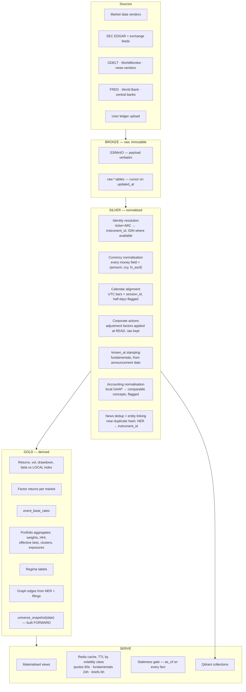
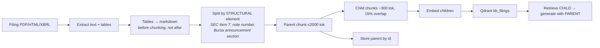

# 06 — Data and knowledge sources

How the system goes international, where every fact comes from, and how each knowledge base is built and kept current.

---

## 1. The coverage ladder

"Not limiting which country" is a goal, not a v1 deliverable. Markets are onboarded in tiers, and a market is not "supported" until it passes its eval suite.

| Tier | Markets | Depth | Gate to enter |
|---|---|---|---|
| **T1 — Deep** | US (XNAS, XNYS), Malaysia (XKLS) | Full: prices, point-in-time fundamentals, filings, transcripts, events, base rates, factor model | All eval suites pass; ≥3y of survivorship-safe history |
| **T2 — Analytical** | Singapore (XSES), Hong Kong (XHKG), Japan (XJPX), UK (XLON), Australia (XASX), India (XNSE), Taiwan (XTAI), Korea (XKRX), Germany (XETR) | Prices, fundamentals, filings, events. Factor model per market once ≥300 instruments have 3y history | Fundamentals coverage ≥80% of index constituents |
| **T3 — Contextual** | Indonesia, Thailand, Vietnam, Philippines, Canada, France, Netherlands, Switzerland, Brazil, Saudi | Prices, news, macro, graph edges. **No factor model, no attribution beyond market/FX** | Price history + calendar only |
| **T4 — Reference** | Everything else | Referenced in the graph as an entity and exposure path; never a candidate | — |

**The tier is visible in every output.** A T3 instrument returns `attribution_unavailable` for style components and says why, rather than producing a decomposition against a factor model that does not exist for that market.

---

## 2. The market adapter contract

Adding a market is filling this in and passing conformance tests. No orchestrator code changes — that is the whole point of the L2 growth layer.

```python
class MarketAdapter(Protocol):
    mic: str                        # ISO 10383, e.g. "XKLS"
    country: str                    # ISO 3166-1 alpha-2
    currency: str                   # ISO 4217
    tier: Literal[1, 2, 3, 4]

    # --- Trading mechanics -------------------------------------------------
    def sessions(self, d: date) -> list[Session]: ...      # incl. lunch breaks
    def holidays(self, year: int) -> list[date]: ...
    def lot_size(self, instrument_id: str) -> int: ...
    def tick_size(self, price: Decimal) -> Decimal: ...
    def settlement_days(self) -> int: ...
    def price_limits(self) -> PriceLimit | None: ...       # limit up/down where applicable

    # --- Costs -------------------------------------------------------------
    def fee_schedule(self) -> FeeSchedule: ...             # commission, min, stamp,
                                                           # clearing, levy, caps
    def withholding(self, income_type: str, holder_country: str) -> Decimal: ...

    # --- Reference ---------------------------------------------------------
    def local_index(self) -> str: ...                      # the benchmark for attribution
    def sector_scheme(self) -> str: ...                    # GICS / local scheme + mapping
    def accounting_standard(self) -> str: ...              # IFRS / US GAAP / local

    # --- Disclosure --------------------------------------------------------
    def filing_calendar(self) -> FilingRules: ...          # deadlines by filer class
    def announcement_source(self) -> SourceRef: ...
    def insider_disclosure(self) -> SourceRef | None: ...
    def short_interest(self) -> SourceRef | None: ...

    # --- Data --------------------------------------------------------------
    def price_source(self) -> SourceRef: ...
    def fundamentals_source(self) -> SourceRef: ...
    def known_at_strategy(self) -> Literal["vendor", "self_built", "unavailable"]: ...
    def universe_snapshot(self, d: date) -> list[str]: ...  # survivorship-safe
```

### 2.1 Conformance tests every adapter must pass

1. Session calendar matches the exchange's published calendar for the last 3 years, including half-days.
2. Fee computation matches a hand-worked example for three trade sizes, including caps and minimums.
3. Lot rounding never produces a fractional lot.
4. `universe_snapshot(d)` for a historical date includes instruments that have since delisted.
5. `known_at` for a sample of 20 fundamental facts is ≥ the announcement date, never the period end.
6. Currency conversion round-trips within tolerance.
7. The local index resolves and has price history covering the instrument history.

### 2.2 Why these fields and not fewer

Each field is here because getting it wrong produces a silent, plausible-looking error:

- **Session calendars differ** and include lunch breaks in several Asian markets. Aligning everything to UTC bars with a `session_id` is the only way daily returns compare correctly across markets.
- **Accounting standard** determines whether two P/E ratios are comparable. IFRS is principles-based and used in 140+ countries; US GAAP is rules-based; the differences reach balance-sheet ratios, earnings and equity directly — impairment reversals are permitted under IFRS for most assets and prohibited under GAAP, development costs are capitalised under IFRS when criteria are met, and balance-sheet ordering is inverted. Ranking a Bursa small cap against an S&P mega-cap on raw multiples is meaningless without normalising for this.
- **Filing deadlines** define how stale "latest fundamentals" can legitimately be. US 10-K deadlines run 60 / 75 / 90 days after fiscal year-end by filer class, and late filers exceed even that. One published audit found 11% of ticker-months in a sample used numbers that were not yet public under a naive `period_end` join.
- **Fee schedules** determine the cost floor, which determines whether a position is viable at all.
- **Withholding** turns a cross-border dividend yield into a different number than the headline.

---

## 3. Source register

Every external dependency, its role, its licence posture and its refresh cadence.

### 3.1 Market data

| Source | Role | Coverage | Cadence | Notes |
|---|---|---|---|---|
| **Primary global vendor** | EOD + fundamentals + calendars across T1–T3 | Global incl. KLSE (MIC `XKLS`) | EOD + delayed intraday | Also exposes historical index components — the raw material for survivorship-safe universe snapshots |
| **Secondary / news vendor** | Quotes, company news, earnings calendars, WebSocket | Global | Real-time | Generous free tier; fundamentals are shallow — use for quotes and calendars, not statements |
| **ASEAN specialist** | Fallback for MY/SG/HK/JP/IN/TW/TH/VN depth | ASEAN + Asia | Real-time | Use if the primary's Bursa depth disappoints |
| **Yahoo Finance (unofficial)** | Dev-time fallback only | Broad | — | **Never load-bearing.** No official API; endpoints break without notice |
| **Exchange direct** | Announcements, corporate actions, suspension notices | Per market | Event | The only authoritative source for `announced_at` |

An abstraction layer over 100+ providers behind one Python interface exists and covers most of this (`obb.equity.price.historical(...)`, provider swappable by parameter, with a FastAPI server and an MCP server). It is effectively the L2 plugin layer already written — with the caveat that it is AGPL-3.0, which matters at the moment this stops being a personal tool.

### 3.2 Point-in-time fundamentals — the one that must not be skipped

| Option | Cost | Verdict |
|---|---|---|
| **Buy the US universe** | ~$49/mo class | Vendors now serve 100M+ point-in-time, survivorship-free SEC facts with normalised concepts, some with an MCP server. Free tiers typically cover the S&P 500 |
| **DIY from SEC EDGAR `companyfacts`** | Free | Public domain, no key, 10 req/s with a User-Agent header. The catch is engineering, not access: XBRL tag drift, stub periods leaking into annual figures, restatement reconstruction. Weekends, not hours |
| **Build Malaysia / ASEAN yourself** | Dev time | **No vendor offers `known_at` for Bursa.** Built from announcement feeds, stamping each figure with its announcement date |

**Recommendation: buy US, build Malaysia.** Phase 3.5 in the roadmap. Building the alpha model before the point-in-time store exists means every result until then is fiction.

### 3.3 News — the five-year corpus

| Source | Role | Cost | Cadence |
|---|---|---|---|
| **GDELT 2.0** | The free, unlimited backbone. 100+ languages, ~300 event categories back to 1979, georeferenced; the Global Knowledge Graph resolves persons, organisations, locations, themes and tone. Full-text search over a multi-year window; bulk access via BigQuery | Free, no key | 15 min |
| **WorldMonitor** | The curated, higher-trust layer: synthesised briefs across 500+ feeds, Country Instability Index for 31 countries, 7-signal market composite, 29-exchange finance radar. MCP + REST + SDK | Free tier / Pro key | 5 min |
| **Article-level sentiment vendor** | Direction *and* magnitude at article level — the granularity that makes a sentiment claim citable | Paid slot | REST |
| **Per-ticker news vendor** | Company-level coverage and buzz | Free tier | Real-time |

**Architecture note:** GDELT gives volume, WorldMonitor gives judgement. Ingest GDELT for entity, theme and tone breadth; use the curated layer as the higher-trust synthesis. **Cross-check them — divergence between raw tone and curated synthesis is itself a signal worth logging.**

Ticker-level aggregate sentiment scores that cannot be traced back to a specific headline are usable as a *feature* and never as *evidence*. That distinction is enforced in the output rail.

### 3.4 Filings, macro, reference

| Source | Role | Licence | Cadence |
|---|---|---|---|
| SEC EDGAR (full-text + `companyfacts` + Forms 3/4/5, 13D/G/F) | US filings and insider data | Public domain | Event, polled daily |
| Bursa / SGX / HKEX / TSE announcement feeds | Local filings, the authoritative `announced_at` | Per exchange terms | Event |
| FRED, World Bank, IMF | Macro series | Permissive | Per series schedule |
| Central bank calendars | Scheduled event blackouts | Public | Static + updates |
| Index provider rebalance notices | Index add/drop events — a large, mechanical price driver | Per provider | Event |

### 3.5 Storage

TimescaleDB for prices, fundamentals, FX and macro — it is a PostgreSQL extension, so existing tooling and ORMs work, joins against instrument metadata work (which you need constantly), continuous aggregates pre-compute rollups, and you keep one database dialect across ledger and market data. Alternatives optimised for raw ingest rate or billion-row analytics solve problems this system does not have: end-of-day plus 15-minute bars across a few thousand instruments is small data.

Charts: an open-source, Apache-2.0-licensed lightweight charting library, self-hosted and embeddable. Note that the heavier commercial charting libraries from the same vendor are explicitly not offered for personal, hobby or study use — the lightweight one is the one you can actually use.

---

## 4. Ingestion architecture

Bronze → Silver → Gold, with a separate real-time lane.



### 4.1 The five normalisation rules that prevent silent corruption

1. **Identity resolution.** `0011.KL` and `MAYBANK` collapse to one `instrument_id`. Without this, the same company appears as three entities and every aggregate is wrong.
2. **Never store a bare number.** Every monetary field carries `(amount, currency, fx_asof)`. Report in base currency **and** native, always.
3. **Corporate actions applied at read, raw kept.** Adjustment factors change when a new action occurs; storing adjusted prices means history silently rewrites itself.
4. **`known_at` on every fundamental row.** Backtests query `known_at <= t`. This is the difference between a backtest and a fantasy.
5. **`universe_snapshot` built forward.** Never reconstructed from a current listing — that reconstruction has already deleted every bankruptcy.

---

## 5. Building each knowledge base

Nine collections, nine different build procedures. This is the "must build the RAG and knowledge source" requirement, concretely.

### 5.1 `kb_filings` — parent-child, structural



Chunking by structural element yields good chunk size without tuning, and preserving section boundaries matters more than any parameter sweep. This is worth the effort: in finance RAG, retrieval and chunking strategy affect output quality more than raw model power does, even when long-context models are available — and generic chunking has been measured producing factual errors in roughly one in seven financial queries.

**Backfill:** 5 years for T1 markets, 3 years for T2, current year for T3. Incremental thereafter, event-driven.

### 5.2 `kb_news` — 5-year rolling, tiered

| Tier | Age | Storage | Retrieval |
|---|---|---|---|
| Hot | 0–12 months | Qdrant, in-memory | Full hybrid |
| Warm | 12–60 months | Qdrant, on-disk + scalar quantization | Full hybrid, higher latency budget |
| Cold | > 60 months | S3 parquet, dropped from index | Rehydrated on explicit historical request |

Build order: dedup by near-duplicate hash → entity link (NER → `instrument_id`, `country_code`) → five-dimension feature extraction (local FinBERT first, LLM escalation only for holdings and live candidates) → embed → index with full metadata.

**Backfill cost is dominated by embedding, and embedding is cheap** — see `08-COST-BREAKDOWN.md` §4. The expensive part is the LLM feature extraction, which is why the escalation ladder exists.

### 5.3 `kb_craft` — the curriculum, with licence tiers

The knowledge base that makes the system able to *teach* rather than only answer. Three licence tiers, and the tier is a field on every chunk that retrieval filters on:

| Tier | Handling | Examples |
|---|---|---|
| **A — ingest freely** | Full body in the index | Public-domain government investor publications, SEC filings, permissively-licensed academic papers (cite by DOI), **your own notes** — over time the highest-value part |
| **B — link only** | Title + URL in the index, **body never** | Free-to-read exchange academies and educational portals, copyrighted curricula, commercial finance sites, books. Free to read ≠ free to redistribute |
| **C — generate** | System-written concept notes, grounded in Tier A with citations, reviewed once by you, then frozen as canonical | Coverage of topics where no public-domain source is good enough |

**Curriculum ladder** — use a published syllabus as the *topic map* (a list of subjects is not copyrightable expression) and fill it with Tier A and Tier C content:

```
L1  Industry structure       roles · participants · regulation · ethics
L2  Investment vehicles      direct vs pooled · ETFs · indices · funds
L3  Instruments & quant      time value · PV/FV/NPV · equities · fixed income · derivatives
L4  Portfolio construction   sizing · Kelly and its limits · vol targeting · rebalancing
L5  Risk & behaviour         drawdown psychology · loss aversion · disposition effect
                             journalling · pre-commitment · sizing as the real edge
L6  Evidence & method        base rates · calibration · Brier · survivorship
                             lookahead · overfitting · why most backtests lie
L7  Market mechanics         per market: lots · fees · settlement · disclosure
                             withholding · FX drag · shariah screening where relevant
L8  Craft of trading         order types · slippage · liquidity · execution
                             thesis writing · exit discipline · when NOT to trade
```

**L5 and L6 matter more to outcomes than L1–L3, and are exactly what free educational content skips. Build them first.**

**Prerequisite graph.** Each concept links to what must be understood first. When the user asks about Kelly sizing and has never engaged with probability calibration, the system says so and offers the prerequisite instead of answering over their head. That single feature is what turns a Q&A box into a teacher.

Seeding is cheap and disproportionately valuable — it can start in Phase 1 as a static markdown folder and only needs a vector store once it outgrows one.

### 5.4 `kb_failures` — the blowup library

The antidote to survivorship bias in the *qualitative* corpus, mirroring what `universe_snapshot` does for the quantitative one.

Build: for each case — public enforcement action, restatement, delisting, or well-documented value trap — write a parent case note grounded in the primary filings, then tag pattern children:

```
accruals_divergence · receivables_run · related_party_dependence
single_customer_concentration · serial_acquirer · covenant_cliff
going_concern_language · auditor_change · segment_reorganisation
peak_cycle_margin_extrapolated · promoter_pledge · capital_raise_treadmill
```

Retrieval is similarity on the **structural pattern**, not the company or sector — the question A11 asks is "what does this situation resemble", and the answer is usually from a different industry and a different decade.

Target 200 cases by Phase 6, ~800 chunks. Growth of 10–20 cases per quarter thereafter, including — especially — the system's own failures.

### 5.5 `event_base_rates` — self-built, no vendor

Fully specified in `03-WHY-IT-MOVED.md` §6. Built once from survivorship-safe history, extended quarterly. This is the knowledge base that makes attribution credible and it exists nowhere else.

### 5.6 The remaining collections

| Collection | Build |
|---|---|
| `kb_transcripts` | Speaker-turn chunks merged to ~600 tokens, never across speakers. Metadata: company, quarter, speaker, role, timestamp, `is_qna` |
| `kb_sector` | Tier A + Tier C primers, ~500 tok concept chunks, tagged to sector node and value-chain position |
| `kb_method_valuation` | Concept chunks with `sector_applicability` — bank methods never retrieved for software |
| `kb_method_technical` | Indicator/pattern definitions, each with its **measured base rate** as structured metadata; `unvalidated` flag where n < 30 |
| `kb_lessons` | Written by A14 on every resolved decision. Tagged with decision type, error class, concept exercised |

---

## 6. Refresh scheduler

```mermaid
gantt
    title Daily ingestion cycle (times in UTC+8)
    dateFormat HH:mm
    axisFormat %H:%M

    section Continuous
    GDELT poll every 15 min      :00:00, 24h
    WorldMonitor poll every 5 min :00:00, 24h
    FX hourly                    :00:00, 24h

    section Asia session
    Bursa SGX HKEX open + quotes :09:00, 8h
    Exchange announcements       :07:00, 12h

    section Post-Asia
    Asia EOD ingest              :17:30, 1h
    Asia fundamentals delta      :18:30, 1h

    section US session
    US open + quotes             :21:30, 7h

    section Overnight batch
    US EOD ingest                :05:00, 1h
    Factor returns recompute     :06:00, 1h
    Portfolio + risk snapshot    :07:00, 30m
    Thesis breaker sweep         :07:30, 30m
    Eval suites                  :08:00, 1h

    section Weekly and quarterly
    Beta re-estimation weekly    :06:00, 1h
    Base rate rebuild quarterly  :06:30, 3h
```



**Ten venues, one continuous tape.** There is no window in which the system can be "off", which is why ingestion is scheduled per session, freshness is a first-class retrieval filter rather than a rerank hint, and every fact an agent sees carries an `as_of`.

---

## 7. Licence boundaries — decide before writing code

| Component | Licence | Obligation |
|---|---|---|
| Template code from permissively-licensed repos | Apache-2.0 | Keep notices; fork and ship freely |
| WorldMonitor source | AGPL-3.0-only | **Hosted API use over the network is normal API use.** Self-hosting a modified instance and exposing it to users triggers source-availability obligations |
| The 100+-provider data abstraction layer | AGPL-3.0 | Same question |
| Market data from vendors | Per provider | **Redistribution is usually prohibited.** Check before exposing raw quotes to anyone but yourself |
| Tier B educational content | Copyrighted | Link only. Never ingest the body. Enforced at retrieval, tested in CI |

**If this stays a personal tool, none of this bites.** If it ever becomes a product, the AGPL conversation is unavoidable and should happen *before* the codebase entangles them. Keep any fork of an AGPL component in a separate repository so the boundary is unambiguous.
