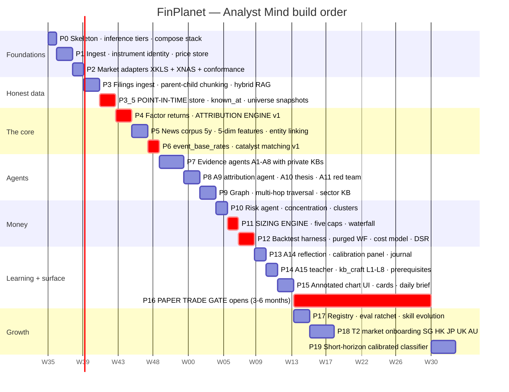

# 07 — Build order

Phases with deliverables and a definition of done. The ordering rule throughout: **anything that produces a number a human might act on comes after the thing that makes that number honest.**

---

## 0. Build status

Every phase except P16 and its dependants is implemented, tested and running on
mock data. `python verify.py` walks the whole pipeline in under a second with no
network and no keys; `pytest` runs 361 tests.

| Phase | Status | Where |
|---|---|---|
| P0 skeleton | done | `core/contracts/`, `core/llm/`, `core/guardrails/`, `core/provenance/` |
| P1 ingest and identity | done | `core/market/instrument.py`, `knowledge/feeds/adapter.py` |
| P2 market adapters | done | `markets/` — XKLS, XNAS, registry |
| P3 filings and RAG | done | `knowledge/chunking/`, `knowledge/retrieval/` |
| P3.5 point-in-time store | done | `core/market/pointintime.py` |
| P4 attribution engine | done | `engines/attribution/` |
| P5 news corpus | done | `knowledge/news/features.py` |
| P6 base rates and catalysts | done | `engines/events/` |
| P7 evidence agents | done | `agents/base.py`, `agents/evidence/agents.py` |
| P8 synthesis | done | `agents/synthesis/agents.py`, `agents/supervisor.py` |
| P9 graph | done | `knowledge/graph/entity_graph.py` |
| P10–P11 risk and sizing | done | `engines/risk/`, `engines/sizing/`, `agents/portfolio/` |
| P12 backtest harness | done | `engines/backtest/` |
| P13 reflection | done | `agents/learning/reflection.py` |
| P14 teacher | done | `agents/learning/teacher.py` — 30 concepts, enforced prerequisite graph |
| P15 surface | done | `ui/render.py` |
| P17 registry and ratchet | done | `core/registry/loader.py`, `evals/` — 16 suites |
| **P16 paper trade gate** | **waiting on elapsed time** | tooling built (`predict.py`, `agents/learning/store.py`); needs 3–6 months of graded outcomes |
| P18 T2 market onboarding | done | `markets/` — 11 adapters, every T2 market docs/06 names |
| P19 short-horizon classifier | blocked on P16 | needs the forward record P16 produces |

**What "waiting" means here.** P16 is not unbuilt work; it is a waiting period.
The machinery is built and tested: the deferred outcome queue and calibration in
`agents/learning/reflection.py`, durable storage in `agents/learning/store.py`,
and a command-line log in `predict.py`. What cannot be compressed is the
accumulation of predictions that have actually resolved at their stated horizons.
Grading them early is refused on purpose (`OutcomeQueue.grade` raises), because a
21-day call scored on day 3 is noise wearing a track record's clothes.

**P18 was previously listed as blocked on P16. That was wrong** — the roadmap has
it after P17, which is done. Onboarding a T2 market needs no forward record; it
needs one `MarketAdapter` subclass, a registry entry, and the conformance tests
that already exist.

The five markets the gantt named (SG, HK, JP, UK, AU) are now registered, and
the claim held: no engine, agent or orchestrator changed. Two things did surface,
and neither was visible before a market needed them —

- `FeeLeg.per_side` was declared and never read, so `round_trip` doubled every
  charge. UK Stamp Duty Reserve Tax is levied on purchases only, and doubling it
  overstates the London floor by 50 bps. An overstated floor refuses positions
  that would have cleared the real one.
- `docs/06` named Japan `XJPX` while `core/market/feed.py` already wrote `XTKS`.
  Both are real MICs — the group operator and the exchange segment — and it is
  the MYX/XKLS drift again. Aliased before it could cost anything.

India, Taiwan, Korea and Germany followed, completing the T2 set `docs/06`
names. The `per_side` fix London forced paid for itself immediately: Taiwan and
Korea both tax the **sell side only** (0.3% and 0.15%), and India levies a
buy-side stamp duty *alongside* a both-sides STT. Four more markets would have
been mis-costed by the doubling bug, three of them by 15–30 bps.

Two premises turned out to be wrong while testing, both about markets already
registered: Hong Kong sets board lots **per instrument** rather than a flat
1,000, and **XNAS has been T+1 since May 2024** — so India is not the only fast
settler and a uniform T+2 assumption would misdate cash on both.

**What is now wired.** GDELT (news) and Stooq (daily bars) are both live and keyless. Filings, ownership and macro remain unwired: their adapters raise
rather than returning empty, so a missing source can never read as a quiet
day. Historically `GdeltFeed._fetch_raw` raised
`NotImplementedError` rather than returning empty. Every live source is one
subclass of `FeedAdapter`; everything downstream of the fetch is built and
tested. The offline build cannot silently pretend to have data.

---

## 1. Roadmap

---

## 2. Phase detail

### P0 — Skeleton (1 week)

| Ships | DoD |
|---|---|
| Repo structure per `01-SYSTEM-ARCHITECTURE.md` §11 | `docker compose up` brings the full stack |
| Inference choke point with four tiers | One module; no agent imports a vendor SDK directly. Tier routing unit-tested |
| Postgres + TimescaleDB + Qdrant + Neo4j + Redis + MinIO | Health checks green |
| Provenance ledger schema | Append-only; every LLM call writes a row with tokens and cost |
| Guardrail chain skeleton | All five rails present, pass-through implementations, tests asserting no path bypasses them |

**Cut nothing here.** The provenance ledger and the guardrail skeleton look like overhead in week one and are unaddable later.

### P1 — Ingest and identity (2 weeks)

| Ships | DoD |
|---|---|
| `instrument` registry with ISIN/MIC resolution | `0011.KL` and `MAYBANK` resolve to one `instrument_id` |
| Price bar ingest, EOD, T1 markets | 5y history, corporate actions applied at read |
| FX store, base-currency conversion | Every monetary value carries `(amount, ccy, fx_asof)` |
| Session calendars | Half-days and lunch breaks correct for 3y |

### P2 — Market adapters (10 days)

XKLS and XNAS implemented against the contract in `06-DATA-AND-KNOWLEDGE-SOURCES.md` §2. **DoD: all seven conformance tests pass for both.** A third market must be addable in under a day by someone who has not read the orchestrator.

### P3 — Filings and RAG (2 weeks)

| Ships | DoD |
|---|---|
| Filing ingest, T1 markets, 5y | Raw in S3, text extracted, tables → markdown |
| Parent-child chunking | Retrieve child, generate with parent; verified on 20 hand-checked queries |
| Hybrid retrieval: BM25 + dense → RRF → cross-encoder rerank | Precision@5 measured and recorded as the baseline everything later must beat |
| Grader with rewrite-retry, max 2 | Refusal path works and is logged |
| Typed generation with mandatory citations | A claim without a chunk ID is dropped, asserted by test |

### P3.5 — Point-in-time store (2 weeks) — **unskippable**

| Ships | DoD |
|---|---|
| `fundamental_facts` with `known_at` on every row | A test asserts no query in the codebase joins on `period_end` for a historical view |
| Restatement handling — append, never update | Restated and first-reported values both retrievable |
| `universe_snapshot(date)` built forward | A snapshot from 3 years ago contains instruments now delisted |
| Bursa `known_at` self-built from announcement dates | Sample of 20 verified against announcement timestamps |
| US point-in-time via vendor | Coverage ≥95% of the target universe |

**Why this blocks everything downstream:** building the alpha model before the point-in-time store exists means every result until then is fiction. It is unglamorous and it is the phase most likely to be rationalised away.

### P4 — Attribution engine v1 (2 weeks) — **the differentiator**

| Ships | DoD |
|---|---|
| Factor return series per T1 market | Size, value, momentum, quality, low-vol; daily |
| Robust beta estimation, `[t−260, t−11]` window | Minimum 120 obs enforced; `attribution_unavailable` below |
| Component decomposition incl. FX | Arithmetic exact to 0.1pp on hand-worked cases |
| `AR`, `SAR`, parametric + rank significance | Both reported; disagreement logged |
| Long-horizon return decomposition | EPS growth / multiple / yield / FX, log-additive |
| **Pure-beta eval suite, 50 cases** | ≥90% return `market_driven`. **This gate blocks the phase** |

### P5 — News corpus (2 weeks)

5-year rolling corpus, hot/warm/cold tiers, dedup, entity linking, five-dimension feature extraction with local-first escalation. **DoD:** entity-linking precision/recall measured on 500 labelled articles; dedup collapses wire duplicates; no LLM call for an article that fails the rule filter.

### P6 — Base rates and catalyst matching (10 days)

`event_base_rates` built across the survivorship-safe history; the six-factor scoring function; the `no_identified_catalyst` verdict. **DoD:** the undisputed-causes suite (200 cases) reaches ≥80% top-1, and the no-news suite (50 cases) reaches ≥70% correct abstention.

### P7 — Evidence agents (3 weeks)

A1–A8, each with its private collection, tool set, output contract and eval suite. **DoD: no agent can query a collection it does not own** — enforced by the retrieval rail and asserted by test.

### P8 — Synthesis (2 weeks)

A9 wraps the P4/P6 engines. A10 produces the thesis memo. A11 red-teams it with an excluded-evidence retrieval config. **DoD:** every breaker A10 writes maps to an executable query — enforced in CI, 100% or the build fails. A11 detects ≥60% of 50 known historical failures presented as if live.

### P9 — Graph (2 weeks)

Neo4j schema, edges built from filings and NER, traversal with path decay, sector KB. **DoD:** no multi-hop claim can be emitted without its traversal path attached.

### P10–P11 — Risk and sizing (3 weeks)

A12 measures; A13 sizes. **DoD:** a property test asserting that no input combination produces a `SizingDecision` breaching any cap; a test asserting the emergency floor cannot be reduced by any API path; Kelly disabled below the trade-count gate, asserted.

### P12 — Backtest harness (2 weeks)

Purged walk-forward with embargo, full cost model, deflated Sharpe, benchmark comparison against all three benchmarks, regime breakdown. **DoD:** a deliberately overfit strategy is correctly flagged by the DSR; random k-fold is not available as an option in the API.

### P13–P15 — Learning and surface (5 weeks)

Reflection, calibration panel, decision journal, teacher, annotated charts, daily brief. **DoD:** the live reliability curve is a permanent UI element; the annotated chart renders `no_identified_catalyst` moves in the same visual language as explained ones; the chart library's `attributionLogo` option is enabled — its licence requires the attribution notice and vendor link on the user-facing page, and this is the most visible screen in the product (see `10-REPOSITORY-REFERENCES.md` §6.3).

### P16 — Paper trade gate (3–6 months, elapsed not effort)

Forward-tested, logged, calibration-checked. **Nothing follows a signal with real money before this closes.** Backtests are hypotheses; this is the test.

---

## 3. What to cut if time runs out

Ordered from "cut first" to "cut only if abandoning the project".

| Cut order | Item | Consequence |
|---|---|---|
| 1 | T2/T3 market breadth | Fewer markets, same quality. Perfectly acceptable |
| 2 | A15 Teacher | Lose the teaching surface; keep a static markdown curriculum |
| 3 | Short-horizon classifier (P19) | Lose the trader layer entirely. The investor layer is where the honest edge is anyway |
| 4 | Neo4j graph / multi-hop | Lose supply-chain reasoning; direct-exposure analysis still works |
| 5 | A11 Red Team | **Costly.** You lose the structural counterweight to confirmation bias |
| 6 | Backtest harness | Now you have no idea whether anything works |
| 7 | Point-in-time store | Everything downstream becomes fiction |
| 8 | Sizing caps / concentration enforcement | The project is now capable of hurting you |
| 9 | Attribution engine | You have built a chatbot with a database |

Items 7–9 are not cuttable. If the choice is between shipping them and shipping nothing, ship nothing and keep using a spreadsheet.

---

## 4. Definition of done for the whole module

The system is done when all of the following are simultaneously true on a live day:

1. Ask "why did X move this week" for any T1 instrument → components before narrative, `unexplained_share` reported, `market_driven` returned when true.
2. Ask "why is X up over five years" → log-additive decomposition into earnings growth, re-rating, yield and FX.
3. Ask for a workup → all 12 steps of `04-ANALYST-METHOD.md` §2 execute, gates fire, valuation method matches the sector archetype, reverse-DCF present.
4. Every claim in every output carries a chunk ID or a row reference, or it was dropped.
5. A sizing request returns the binding cap by name, and no cap can be breached by any input.
6. The live reliability curve is visible and the Brier kill switch is armed.
7. A new market can be onboarded by one adapter class plus a YAML entry.
8. Every agent retrieves only from the collections it owns.
9. No order-placement code exists anywhere in the repository.
10. The nightly eval suite runs, and a regression on any existing suite blocks promotion.

### 4.1 Where each criterion stands

| # | Criterion | Status |
|---|---|---|
| 1 | components before narrative, `unexplained_share` reported | met — `engines/attribution/`, `ui/render.py` |
| 2 | five-year log-additive decomposition | met — `long_horizon_decompose` |
| 3 | 12-step workup with gates | met — `engines/analysis/workup.py` (2026-09-06; before that the agents existed but nothing ran the twelve steps in order) |
| 4 | every claim cited or dropped | met — `verify_answer`, per-claim drop |
| 5 | binding cap named, no cap breachable | met — `SizingDecision.__post_init__` raises |
| 6 | live reliability curve and Brier kill switch | **machinery met, curve needs P16** |
| 7 | new market = one adapter + a YAML entry | met — `markets/registry.py`, `core/registry/loader.py` |
| 8 | every agent retrieves only from what it owns | met — `Router.get` raises `CollectionScopeError` |
| 9 | no order-placement code anywhere | met — policy, registry denylist, and a repo-wide grep with a rot check |
| 10 | eval regression blocks promotion | met — ratchet refuses registration; near-miss failures disqualify regardless of pass rate |

Criterion 6 is the only one that time, rather than code, still gates.
