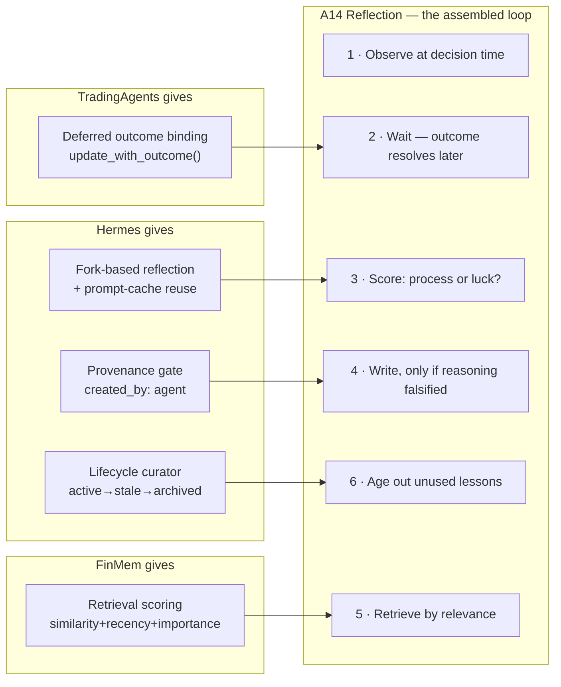

# 13 — The self-learning loop

What [`NousResearch/hermes-agent`](https://github.com/NousResearch/hermes-agent) does, and how much of it lands here.

**Method.** Cloned and read on 24 August 2026 at [`652f5d74`](https://github.com/NousResearch/hermes-agent/tree/652f5d740cb79008a42de8c18786623f0f8d1f0e) (245 MB). MIT licence — copy freely, keep the notice. Line references below are from that commit.

**Why it matters here.** `11 §2` recorded that the L4 self-evolving-workflow layer was effectively unbuilt: the template the original plan nominated for it is 86 lines. Hermes is the reference that was missing — roughly 5,000 lines across a reflection loop, a provenance gate and a lifecycle curator. It is also the only one of the four repos studied that treats *"the agent edits its own capabilities"* as an engineering problem with invariants rather than a demo.

---

## 1. What Hermes actually does

Four mechanisms, and they are separable — you can take three and reject the fourth.

### 1.1 Fork-based background review

[`agent/background_review.py`](https://github.com/NousResearch/hermes-agent/blob/652f5d740cb79008a42de8c18786623f0f8d1f0e/agent/background_review.py) (1,663 LOC). Its own docstring states the design:

> After every turn, `AIAgent.run_conversation` may call `spawn_background_review` to fire off a daemon thread that replays the conversation snapshot in a **forked** `AIAgent` and asks itself "should any skill/memory be saved or updated?". Writes go straight to the memory + skill stores. **Main conversation and prompt cache are never touched.**

Four properties do the work:

| Property | Where | Why it matters |
|---|---|---|
| The reflection runs in a **fork**, not inline | `spawn_background_review_thread` L1595 | The working context is never polluted by the agent thinking about itself |
| The fork **inherits the parent's runtime** — provider, model, credentials, cached system prompt | docstring | It **hits the same prefix cache**, so reflection costs a fraction of a fresh call |
| **Tool whitelist limited to memory and skill tools**; everything else denied at runtime | docstring | The reflector cannot act on the world, only on its own knowledge |
| **Cancelled when a live turn arrives** | `cancel_background_review_for_live_turn` L152 | Reflection is strictly lower priority than the user |

Bounded by `_REVIEW_MAX_ITERATIONS = 16` (L205) and `_REVIEW_MAX_INPUT_TOKENS_DEFAULT = 600_000` (L222). Inside the review thread it installs an approval callback that **auto-denies** (`_bg_review_auto_deny`, L1092) — anything needing a human is refused rather than left blocking a daemon thread nobody is watching.

### 1.2 A provenance gate on what may be auto-edited

[`tools/skill_usage.py`](https://github.com/NousResearch/hermes-agent/blob/652f5d740cb79008a42de8c18786623f0f8d1f0e/tools/skill_usage.py) (1,394 LOC). `is_curator_managed()` at L508 is the whole gate: a skill is auto-editable **only if it carries a `created_by: agent` marker**.

The design notes are worth quoting because each one is a decision:

> - **Sidecar, not frontmatter.** Keeps operational telemetry out of user-authored `SKILL.md` content and avoids conflict pressure for bundled/hub skills.
> - **Provenance filter:** curator-managed skills are explicitly marked when created through `skill_manage`. Bundled / hub-installed skills stay off-limits, and **manually authored skills are not inferred from location**.

That last clause is the important one. Being in the right directory does not make a skill agent-editable — it must have been *created by the agent* and marked as such. Human-authored content is off-limits by default, not by convention.

### 1.3 A lifecycle curator

[`agent/curator.py`](https://github.com/NousResearch/hermes-agent/blob/652f5d740cb79008a42de8c18786623f0f8d1f0e/agent/curator.py) (2,034 LOC). Its stated invariants:

> - Only touches agent-created skills
> - **Never auto-deletes — only archives. Archive is recoverable.**
> - Pinned skills bypass all auto-transitions
> - Uses the auxiliary client; **never touches the main session's prompt cache**

States: `active → stale` (unused > N days) `→ archived` (unused > M days, moved to `.archive/`), with `pinned` as an orthogonal opt-out. Transitions in `apply_automatic_transitions()` L305.

**It is inactivity-triggered, not scheduled** (`should_run_now` L233): it runs when the agent is idle *and* the last run was longer than `interval_hours` ago. No cron daemon. Maintenance happens in the gaps rather than competing with work.

### 1.4 A deliberate bias toward writing

From `_SKILL_REVIEW_PROMPT` (L453):

> Be **ACTIVE** — most sessions produce at least one skill update, even if small. **A pass that does nothing is a missed learning opportunity, not a neutral outcome.**

Plus a shape rule — *"CLASS-LEVEL skills, each with a rich SKILL.md and a `references/` directory… not a long flat list of narrow one-session-one-skill entries"* — and a preference order that tries the cheapest action first: patch the skill that was actually loaded this session → patch an existing umbrella → add a support file → only then create something new.

---

## 2. How it lands here



Three repos, three parts of one loop. None of them has all three.

| Hermes mechanism | Lands in | Verdict |
|---|---|---|
| Fork-based reflection, main context untouched | A14 | **Adopt** — solves the context-pollution problem directly |
| Fork inherits runtime → prefix-cache reuse | Cost control, `08 §7` | **Adopt** — makes reflection nearly free |
| Tool whitelist inside the fork | Guardrails, `05 §8` | **Adopt** — pairs exactly with the policy engine in `12 §2.1` |
| Auto-deny approval inside the review thread | Guardrails | **Adopt** — an unattended thread must never wait on a human |
| Cancel on live turn | Scheduler | **Adopt** |
| **Provenance gate (`created_by: agent`)** | **L3/L4 promotion gate** | **Adopt — this is the piece the plan was missing** |
| Sidecar telemetry, not frontmatter | Eval metrics | **Adopt** |
| Lifecycle: active → stale → archived, never delete | `kb_lessons` hygiene | **Adopt** |
| Inactivity-triggered, not cron | Scheduler | **Adopt** — fits a system with 15-minute polls and multi-month horizons |
| **"Be ACTIVE — a no-op pass is a missed opportunity"** | A14 lesson-writing | **Reject, and invert it** — §3 |

### 2.1 The provenance gate answers an open question

`01 §10` describes four growth layers, with L4 — the system rewriting its own orchestration — gated on human approval. It did not say *how* the boundary between agent-editable and human-authored is enforced. Hermes answers it: **an explicit provenance marker written at creation time, never inferred from location.**

Applied here:

```
kb_lessons/        created_by: agent   → A14 may patch, archive, consolidate
kb_craft/          created_by: human   → read-only to every agent, forever
kb_method_*/       created_by: human   → read-only (the reviewed, frozen Tier C notes)
kb_failures/       created_by: human   → read-only; new cases are a human act
agents/registry.yaml                   → read-only; L4 proposes a diff, never writes
```

The rule that makes it safe is the one Hermes states explicitly: **being in the right directory is not provenance.** A lesson file that appears in `kb_lessons/` without a marker is unmanaged and untouchable, not adopted by default.

### 2.2 Archive, never delete

`kb_lessons` will accumulate wrong lessons — a lesson written from a run of luck that later proves to be noise. Hermes's answer is the right one: **archive is recoverable, deletion is not.** A lesson that stops being retrieved goes stale, then archives, and stays readable. That also gives A14 something to measure: *how many archived lessons were later proved right?* A high number means the aging policy is too aggressive.

---

## 3. The one thing to invert

Hermes's reflector is told a no-op pass is a **missed opportunity**. For this system, a no-op pass is the **correct and expected outcome**, and the bias must run the other way.

The reason is economics, not taste.

| | Hermes | Module 5 |
|---|---|---|
| Learning from | User corrections — *"stop being verbose"* | Market outcomes |
| Signal quality | **Near-deterministic.** The user said it; it is true | **Mostly noise.** Honest short-horizon hit rate is 53–56% |
| Cost of a wrong lesson | Mild — a slightly-off style preference | **Compounding.** A superstition that changes position sizing |
| Cost of a missed lesson | A repeated annoyance | One more instance of a mistake you would have made anyway |
| Correct bias | **Write eagerly** | **Write rarely** |

At a 53–56% hit rate, close to half of all outcomes resolve against you **by chance**. A reflector told "most sessions produce at least one lesson" will manufacture lessons out of randomness — which is precisely the superstition `02 §2` A14 exists to prevent:

> Error attribution distinguishes **bad process from bad luck** — a well-reasoned decision with a poor outcome must not generate a "lesson" that degrades the process. Only decisions where the *reasoning* was falsified produce lessons.

So the A14 review prompt inverts Hermes's instruction:

```
Most reviews produce NO lesson. That is the correct outcome, not a failure.

A poor outcome is not evidence of poor reasoning. Before writing anything,
answer: was a stated driver falsified, or did a correctly-reasoned position
simply land on the wrong side of a distribution?

Write a lesson ONLY when the reasoning was falsified — a driver that did not
hold, a breaker that fired for a reason not anticipated, a base rate applied
to the wrong reference class, a cap that bound in a way not foreseen.

Never write a lesson from a single outcome. A pattern needs a reference class.
```

**The metric follows the bias.** Hermes could reasonably track lesson *count*; A14 tracks **lesson precision** — of lessons written, how many were later confirmed by an independent instance? — exactly as `05 §8.1` measures refusal precision rather than refusal rate.

Everything else about Hermes's shape survives inversion, including the two rules worth keeping verbatim: prefer patching an existing lesson over creating a new one, and keep lessons **class-level** rather than one-per-decision. A flat list of 400 single-decision notes is not a knowledge base.

---

## 4. The structural gap Hermes does not fill

**Hermes's loop closes at end of turn.** The conversation ends, the reflector reads the transcript, the outcome is already known — the user's reaction *is* the ground truth, available immediately.

A14's loop closes **when the position closes**, which under `04 §1` may be 24 months later. At the moment of decision there is no outcome to reflect on at all.

That is not a small difference. It means A14 needs machinery Hermes has no reason to have:

| Need | Hermes | Source |
|---|---|---|
| Record the decision and its reasoning at decision time | Implicit — the transcript | `store_decision()` — TradingAgents `memory.py` L30 |
| **Bind the realised outcome back to it, later** | **Absent** | `update_with_outcome()` L99 · `batch_update_with_outcomes()` L164 |
| Score against a benchmark, not raw return | Absent | `reflect_on_final_decision(..., alpha_return, benchmark)` — TradingAgents `reflection.py` L31 |
| Retrieve past lessons by relevance, not recency | Present but simpler | FinMem `LinearCompoundScore` — `12 §2.10` |
| Age out lessons nobody retrieves | **Present** | Hermes `curator.py` |

So the assembled A14 is: **Hermes's fork mechanism and provenance gate + TradingAgents' deferred outcome binding + FinMem's retrieval scoring**, with the write-bias inverted. Each repo contributes the part the others lack.

**One consequence worth planning for.** A deferred-reflection queue means lessons arrive on the horizon's schedule, not the session's. A long-horizon position opened in P16 produces its first honest lesson around P16 + 24 months. The loop is real but slow, and the calibration panel will be sparse for a year — which is another reason the paper-trade gate exists and another reason the short-horizon classifier (`07`, P19) is scheduled after it: short horizons resolve fast enough to populate the loop while the long book is still open.

---

## 5. What to build, and when

| Phase | Item | Reference |
|---|---|---|
| **P0** | Provenance markers on every knowledge store from day one — `created_by`, `reviewed_at`, `managed` | `skill_usage.py` L508. Retrofitting provenance later means auditing every file by hand |
| **P0** | Sidecar telemetry file per collection; never write operational counters into authored content | `skill_usage.py` docstring |
| **P13** | Fork-based reflection with runtime inheritance and a memory-only tool whitelist | `background_review.py` L1595, L1092 |
| **P13** | Deferred outcome queue: decision recorded at entry, outcome bound at close | TradingAgents `memory.py` L30 / L99 |
| **P13** | The inverted review prompt, §3 | — |
| **P13** | Lesson retrieval scoring | FinMem `compound_score.py` |
| **P17** | Inactivity-triggered curator: stale → archive, pinned opt-out, **never delete** | `curator.py` L233, L305 |
| **P17** | Lesson-precision metric in the nightly fitness function | `01 §10` |

### 5.1 Status, re-checked August 2026

Re-read at `main` on 30 Aug 2026 against the August study at `652f5d74`. **The
four mechanisms above are still the right four** — nothing in the newer modules
changes the analysis:

| Module (new since the study) | What it is | Verdict |
|---|---|---|
| `agent/learning_graph.py` | a desktop visualisation of which skills connect to which memories; edges from lexical token overlap, no confidence, no decay | Weaker than `knowledge/graph/`, which already models exactly that edge as `INFERRED` and refuses to cite it |
| `agent/insights.py` | usage analytics — tokens, cost, tool frequency, activity streaks | `core/provenance/ledger.py` already computes this |
| `agent/error_classifier.py` | a priority-ordered taxonomy of ~20 API failure modes → retry / rotate credential / compress / abort | **Genuinely better than ours.** See below |
| `agent/learning_mutations.py` | mutation operations over the learning graph | Not applicable — that graph is a display artefact |

**The one thing worth taking is not about learning at all.** `core/llm/backends.py`
has a flat `RETRY_STATUS = {429, 500, 502, 503, 529}`. Hermes distinguishes
*retryable* auth from *permanent* auth, and separates **context overflow** —
which must compress rather than retry — from a generic 400. Retrying a context
overflow is an infinite loop that bills for every attempt. Worth adopting when
the key is wired; it costs nothing to build offline and cannot be tested without
one.

Of the eight items in the table above, **five are built**: provenance markers
(`core/contracts/provenance_marker.py`), sidecar telemetry
(`core/provenance/sidecar.py`), the deferred outcome queue and the inverted
prompt (`agents/learning/reflection.py`), and the inactivity curator
(`A15Reflection.curate`, which archives on hit rate and marks stale on age).

Two are now built here:

- **Lesson retrieval scoring** — `agents/learning/scoring.py`. The store returned
  `active()` in insertion order, so with twenty lessons the twentieth was read
  last regardless of merit. Multiplicative, following FinMem's compound score:
  recency × relevance × evidence, so a lesson failing any term sinks rather than
  being carried by a strong one. **Importance is evidence, not an LLM rating** —
  a model asked how important its own lesson is will say "very".
- **The nightly fitness function** — `core/provenance/fitness.py`, specified in
  `01 §10` and never computed. Three of its seven terms cannot be computed from
  anything recorded today, so it **emits no headline score at all** and instead
  reports what is missing and what would supply it. That report is the useful
  output: `python ask.py fitness`.

**Fork-based reflection remains unbuilt**, and deliberately: the mechanism is a
restricted tool surface for a review context, which only means anything once a
model is doing the reviewing.

**Do not skip the P0 items.** They are two fields and a JSON file, they cost an afternoon, and without them the L4 gate in `01 §10` has nothing to enforce against. Every other item on this list depends on being able to answer "did a human write this?" — and that question cannot be answered retroactively.
